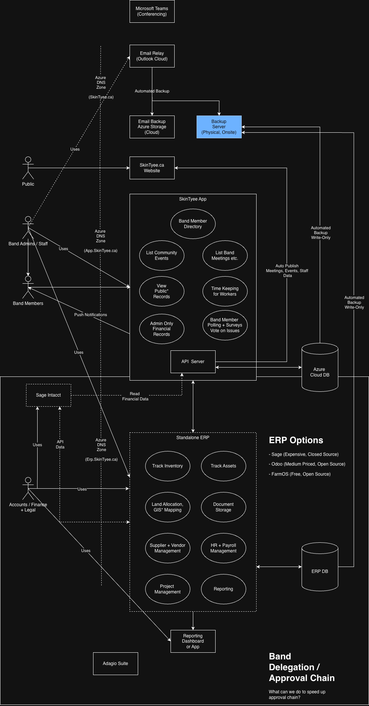
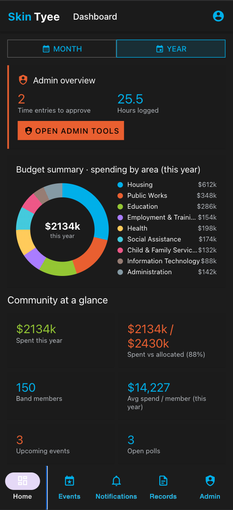
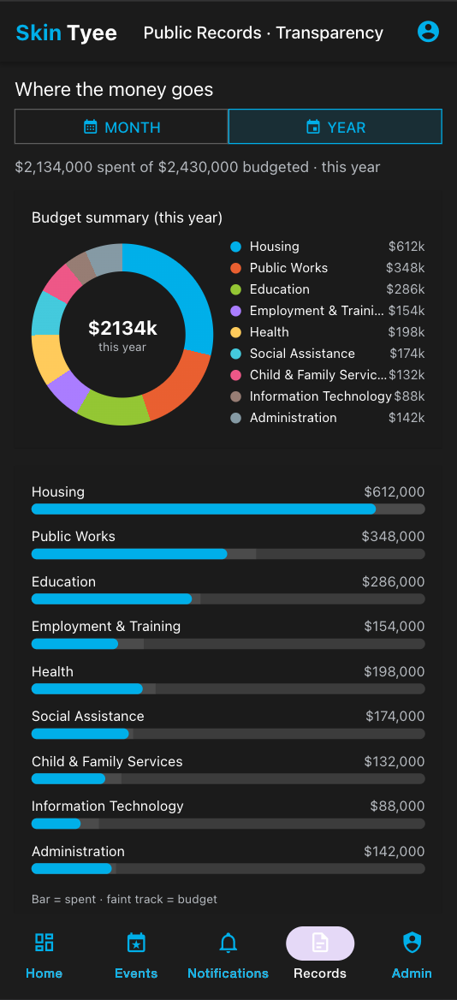
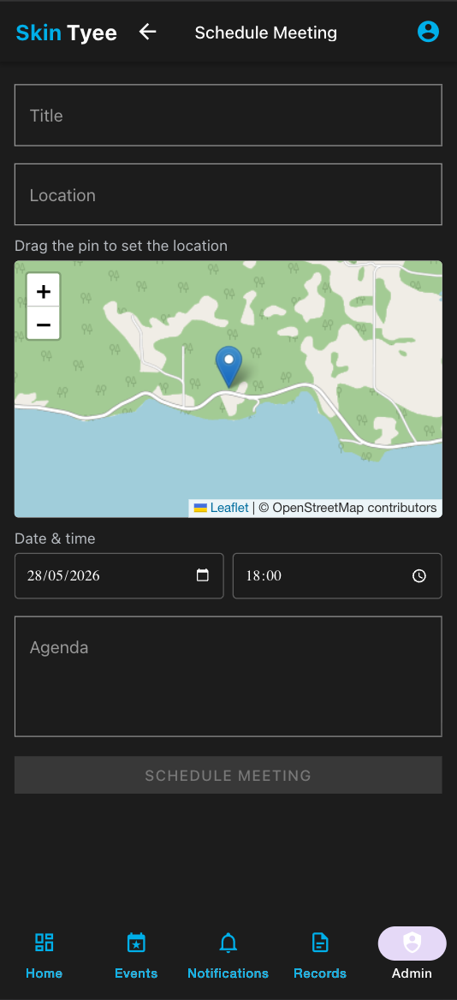
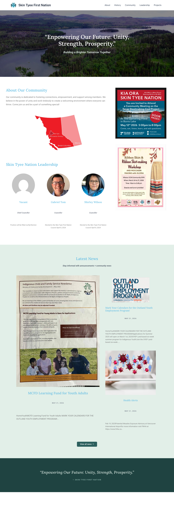
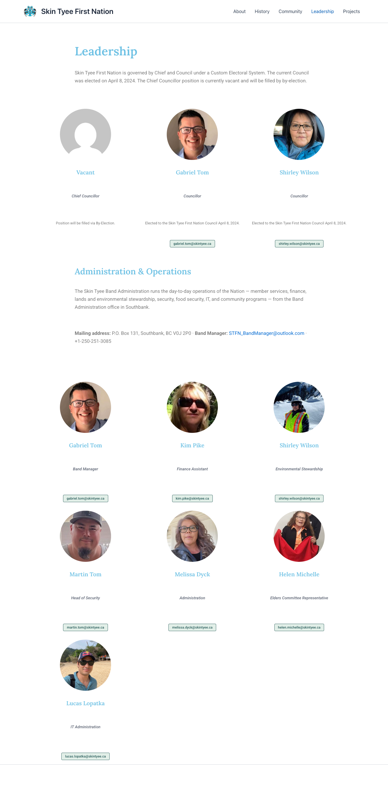
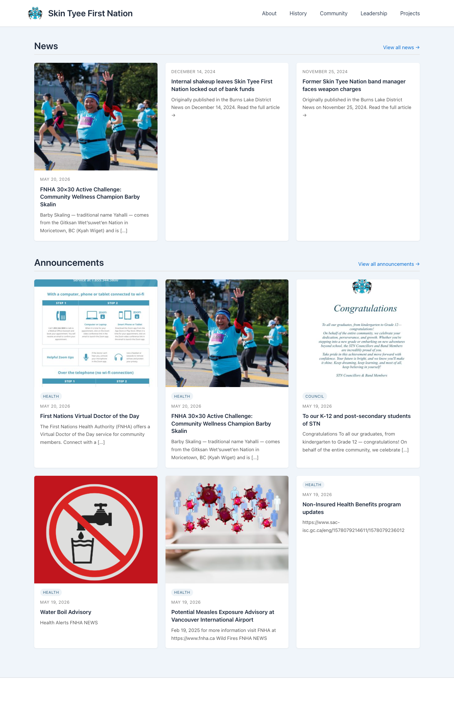

# webfront

Web presence for **Skin Tyee First Nation** — the public website (`skintyee.ca`)
and the community **app**, managed together as a pnpm workspace.

The site is a self-hosted WordPress install migrated from the previous
Site123-hosted `skintyeefirstnation.org`. The app is a React Native + Expo
proof-of-concept built for the proposal.

## Contents

| Section | What's in it |
|---|---|
| **Overview** | |
| &nbsp;&nbsp;&nbsp;&nbsp;[Purpose](#purpose) | What we're building and why — identity, transparency, community, NGO priorities |
| &nbsp;&nbsp;&nbsp;&nbsp;[Architecture](#architecture) | Top-level diagram of the platform |
| &nbsp;&nbsp;&nbsp;&nbsp;[Visual walkthroughs](#visual-walkthroughs) | App + website screenshot tours |
| &nbsp;&nbsp;&nbsp;&nbsp;[Layout](#layout) | Repo / workspace structure |
| **Infrastructure & people** | |
| &nbsp;&nbsp;&nbsp;&nbsp;[Microsoft 365 integration](#microsoft-365-integration) | Entra ID, shared mailboxes, SharePoint docs auto-publish |
| &nbsp;&nbsp;&nbsp;&nbsp;[Source control & CI/CD](#source-control--cicd) | Azure DevOps primary, GitHub mirror (per ADR-9) + the SharePoint publisher Pipeline |
| &nbsp;&nbsp;&nbsp;&nbsp;[Staff onboarding](#staff-onboarding) | New-staff sequence: Outlook (with mandatory password change) → 1Password → shared mailboxes → band apps |
| &nbsp;&nbsp;&nbsp;&nbsp;[Password management](#password-management) | Vaults, groups, recovery (1Password Business) |
| &nbsp;&nbsp;&nbsp;&nbsp;[Domains (GoDaddy)](#domains-godaddy) | `skintyee.ca` registrar + Azure DNS |
| &nbsp;&nbsp;&nbsp;&nbsp;[Developer tools](#developer-tools) | IntelliJ Ultimate + Claude Max |
| **Reference** | |
| &nbsp;&nbsp;&nbsp;&nbsp;[Pricing & costs](#pricing--costs) | Pricing for all software / services — recurring + one-time (M365, 1Password, GoDaddy, Azure, app stores, dev tools), each with tax-deductibility |
| &nbsp;&nbsp;&nbsp;&nbsp;[Documentation](#documentation) | Index of every doc in this repo |
| &nbsp;&nbsp;&nbsp;&nbsp;[Conventions](#conventions) | Git workflow + branch rules |
| **Packages** | |
| &nbsp;&nbsp;&nbsp;&nbsp;[app/](#app--skin-tyee-community-app) | `@skintyee/app` — Skin Tyee community app (React Native + Expo) |
| &nbsp;&nbsp;&nbsp;&nbsp;[api/](#api--skin-tyee-api-proposed) | `@skintyee/api` — API contract + stub server |
| &nbsp;&nbsp;&nbsp;&nbsp;[lookup/](#lookup--skin-tyee-lookup-tool) | `@skintyee/lookup-api` + `@skintyee/lookup-app` — Canadian business / funding / Nations lookup tool |
| **Run & deploy** | |
| &nbsp;&nbsp;&nbsp;&nbsp;[Getting started](#getting-started) | `pnpm install` + first-run commands |
| &nbsp;&nbsp;&nbsp;&nbsp;[Deployment](#deployment) | WordPress site via Azure DevOps; app via EAS Build |

## Purpose

Give Skin Tyee First Nation a **modern, self-owned digital platform** —
website, community app, email, and admin tooling — built on the Nation's own
**Microsoft 365 + Azure** tenant rather than rented third-party services. The
goals below guide it.

### One identity for everything

The backbone is **Microsoft Entra ID** (Azure AD): a **single identity** that
ties together Microsoft 365 (email/Teams/Office), the **Azure** subscription
(website, DNS, database), the **app's** sign-in and roles, and — over time —
**workstation and server access** via SSO. One account per person, one place to
grant or revoke access. (Details: [`docs/365/entra-id.md`](docs/365/entra-id.md).)

### The app as the friendly admin front-end

The **app becomes the front-end for that identity**: band admins add a member,
assign a role, or offboard someone **once in the app**, and it
provisions/deprovisions them across Entra ID and Microsoft 365 (license, groups,
shared mailboxes) behind the scenes — no admin-center expertise needed.

### Transparent band management

The app makes the Nation's finances visible to members: **band expenditures by
program area** (Housing, Public Works, Education, Health, Social Assistance, …)
with **budget-vs-actual** and drill-down breakdowns of *how much was spent and
where*, plus **major capital projects** — sourced from the band's financial
system (Ferrus ASAP / Adagio / Sage). Open books build trust and accountability.

### Keeping the community informed & engaged

One place for **push notifications** (health & safety alerts like water
advisories or wildfire notices, and council announcements), **band meetings**
(agendas, schedules, minutes), **community events**, and **polling & voting on
issues** — so members hear about what matters and have a say, with notifications
categorized to match the skintyee.ca website.

### Website integration (publish to the public)

The app and the **skintyee.ca** website share data: public-facing content
entered/managed in the app — **community events, band meetings (and notes),
public records/transparency, and announcements** — is **auto-published to the
WordPress site** so the general public sees it without needing the app.

**Enter it once.** Staff manage this content in the app and it flows to the
website automatically — **no separate website updates, no double data entry,
and no keeping WordPress in sync by hand.** The app is the single source of
truth; the public site stays current on its own. Notification categories already
mirror the website's taxonomy (Health / Safety / Council / Events / …), so one
update reaches both audiences. (The diagram's *Auto-Publish* flow — see
[`docs/SkinTyee.drawio.pdf`](docs/SkinTyee.drawio.pdf).)

### NGO priorities

As an NGO, the priorities are **easy backups, auditability, and clear,
tax-deductible operating costs** over minimizing spend.

### Education & open source

By embracing **open-source technology** and **partnering with the community and
local schools**, the platform is also a learning opportunity. Transparent,
open processes improve **education about band management and governance** — and
because the project is open source and serves the Nation directly, it gives
**youth real, hands-on opportunities in tech**: students can learn from and
**contribute to** a live project that matters to their own community. The aim is
to **build capacity in-community**, not just buy software.

> **Not everything is open source — by design.** The **financial / ERP systems
> (Sage 300, Adagio, Ferrus ASAP)** are **internal, staff-only finance tools —
> not public-facing.** They are intentionally **closed-source**, commercial,
> First-Nations-specific software kept that way for **security** around sensitive
> financial and member data. Open source applies to the **public platform**
> (website + app); the **books stay on established, supported, audited systems**
> that the app *reads from* (e.g. to publish transparency totals) rather than
> replaces.

## Architecture

The platform at a glance — actors (Public / Band Members / Admins & Staff), the
app and its features, the website, the API server + Azure Cloud DB, and the
ERP / band-delegation pieces. Full detail in
[`docs/SkinTyee.drawio.pdf`](docs/SkinTyee.drawio.pdf).

[](docs/SkinTyee.drawio.pdf)

## Visual walkthroughs

**App** — the Skin Tyee community app:

[  ](docs/walkthrough.md)

📱 **[See the full app walkthrough →](docs/walkthrough.md)** — dashboard & charts, events, notifications (list + calendar), directory, meetings, polls/voting, transparency, time keeping, and the admin tools.

**Website** — the skintyee.ca WordPress site:

[  ](docs/website-walkthrough.md)

🌐 **[See the full website walkthrough →](docs/website-walkthrough.md)** — home, about, history, leadership, community, projects, news, announcements, gallery, and more (full-page screenshots of every page).

## Layout

```
.                      # webfront repo root + pnpm workspace
├── app/               # @skintyee/app — Skin Tyee community app (React Native + Expo)
├── api/               # @skintyee/api — API contract (OpenAPI) + stub server
├── website/           # WordPress site + migration tooling (git subtree)
├── docs/              # project + app docs, architecture decisions, proposal deck
├── package.json       # pnpm workspace root
└── pnpm-workspace.yaml
```

`website/` is vendored as a **git subtree** (not an npm package). Pull/push it
with `git subtree pull|push --prefix=website <remote> <branch>`.

## Microsoft 365 integration

Email/identity run on **Microsoft 365** (the Outlook Cloud "Email Relay" in the
architecture diagram). Role addresses like `info@skintyee.ca`, `admin@skintyee.ca`,
and `chief@skintyee.ca` are **shared mailboxes** that licensed staff work from
with their own logins.

🆔 **[Entra ID, admin account & access →](docs/365/entra-id.md)** — the
`admin@…onmicrosoft.com` break-glass admin (governs 365 + Azure), Entra ID
Connect (hybrid identity), and how Entra ID drives SSO and workstation/server
access.

📬 **[Shared mailbox setup & adding users →](docs/365/shared-mailboxes.md)** —
how shared mailboxes are created in the M365 admin center and how individual
(licensed) users are granted access (Full Access / Send As / Send on Behalf),
with reference screenshots and the current mailbox/member list.

👥 **[Microsoft 365 Groups vs Security Groups →](docs/365/groups.md)** —
when to use which (the trap: don't pick M365 Group for everything — it drags
an unused shared mailbox + SharePoint site along). Reference table + concrete
examples mapped to our actual licensing / Conditional Access / app-role
structure.

💲 **[Microsoft 365 pricing & tax →](docs/365/pricing.md)** — Business Standard
(with Teams) per-user cost, why it's 100% tax-deductible under Canadian law, and
the rule to **unlicense departed/terminated staff immediately**.

🔁 **[SharePoint docs auto-publish →](docs/365/sharepoint-docs-publish.md)** —
every push to `master` that touches `docs/` mirrors the tree (markdown +
pandoc-rendered HTML) to a SharePoint document library via Microsoft Graph.
One-time Entra ID app + `Sites.Selected` setup walkthrough.

Related email services: **[ImprovMX](docs/improvmx/README.md)** (forwarding
aliases / secondary domains into M365) and **[Mailgun](docs/mailgun/README.md)**
(transactional / app-sent email).

## Source control & CI/CD

Source code lives on **Azure DevOps** as the canonical Git host
(`dev.azure.com/skintyeenation`) with GitHub as a read-only mirror for
public discoverability. CI/CD runs on **Azure Pipelines** for
consistency with the rest of the Microsoft footprint. Per
[ADR-9](docs/architecture-decisions.md#adr-9--source-control-azure-devops-as-primary-github-as-mirror).

🛠️ **[Azure DevOps overview →](docs/devops/README.md)** — why Azure
primary, what's on GitHub, the four runbooks linked from below.

⚙️ **[One-time setup walkthrough →](docs/devops/azure-devops-setup.md)**
— `scripts/setup-azure-devops.sh` (bash) / `.ps1` (PowerShell mirror)
creates the `skintyeenation` org, the `devops` project, the repo,
pushes the existing Git history, and sets branch policy on `master`.

🔁 **[GitHub mirror push →](docs/devops/azure-primary-github-mirror.md)**
— how every push to Azure auto-mirrors to GitHub in ~60s via a small
Azure Pipeline using a repo-scoped deploy key.

📦 **[Migrating CI workflows →](docs/devops/migrate-ci-workflows.md)**
— porting the SharePoint docs publisher from `.github/workflows/`
to `azure-pipelines/` with **federated credentials** (no more
24-month `AZURE_CLIENT_SECRET` rotation).

🤖 **[Self-hosted agents →](docs/devops/agents.md)** — when to bring
them in (TL;DR: not yet — hosted free-tier minutes cover us).

## Staff onboarding

The end-user-facing onboarding sequence for new Skin Tyee staff. Companion to
the admin-side docs above — the admin does their part (creating accounts,
assigning licenses, granting access) and the staff member walks the four-step
sequence below to get set up on every device.

| # | Step | What the admin sends you | Walkthrough |
|---|---|---|---|
| 1 | Activate your `@skintyee.ca` Outlook account (set a new password, register MFA) | Your work username + a **temporary** password by email — **expires on first sign-in, you'll be forced to change it** | [outlook-skintyee-ca.md](docs/onboarding/outlook-skintyee-ca.md) |
| 2 | Install + sign into 1Password | A 1Password invite email + (separately) your Secret Key on paper or sealed PDF | [1password.md](docs/onboarding/1password.md) |
| 2b | _(optional)_ Switch 1Password to "Unlock with SSO" so your Entra ID account unlocks the vault | Admin confirms org-level Entra ID ↔ 1Password integration is enabled | [1password.md § Step 6](docs/onboarding/1password.md#step-6--connect-1password-to-entra-id-unlock-with-sso) |
| 3 | _(if applicable)_ Get added to shared mailboxes (`info@`, `chief@`, `admin@`) | Admin grants Full Access + Send-As permission | [365/shared-mailboxes.md](docs/365/shared-mailboxes.md) (auto-maps in Outlook within ~24h — no extra password) |
| 4 | _(if applicable)_ Get added to band apps (Skin Tyee app, WordPress editor, Azure DevOps, etc.) | Per-app invitation | Per-app — admin points you at the right doc |

**End state** when steps 1-2 are done:
- A working **`firstname.lastname@skintyee.ca`** address on your laptop, phone, and the web.
- Membership in any **shared mailboxes** you need — auto-mapped in Outlook, no second password.
- **1Password** with your own vault + the shared vaults for your role.
- **Single sign-on** into Microsoft 365 (Outlook, Teams, OneDrive, SharePoint, the Skin Tyee app) using the same `@skintyee.ca` login.

> **For governance review:** the 1Password walkthrough includes a
> [Security model + liability section](docs/onboarding/1password.md#security-model--liability-for-council--governance-review)
> that documents the zero-knowledge architecture, the contractual liability
> ceiling (capped at fees paid — standard B2B SaaS), and the admin's
> incident-response runbook if 1Password ever reports a breach. Council
> can review this before signing off.

👋 **[Open the full onboarding section →](docs/onboarding/README.md)** — the
sequence table above with the "if you get stuck" troubleshooting bucket, the
section's scope (what it covers and explicitly doesn't), and links to the
admin-side companion docs.

## Password management

Credentials and secrets live in **1Password (Business)** — encrypted vaults with
per-team/role access, so staff never email passwords and access is cut off
instantly when someone leaves.

🔐 **[1Password setup & user management →](docs/1password/setup.md)** — vaults,
groups, provisioning users, and offboarding.
💲 **[1Password pricing & tax →](docs/1password/pricing.md)** — per-user cost,
100% Canadian tax-deductibility, and immediate deprovisioning of departed staff.

## Domains (GoDaddy)

Domains are registered at **GoDaddy** — `skintyee.ca` (primary) plus
`skintyee.com` / `.org` / `.net` (defensive, forwarded to `.ca`) — with DNS in
**Azure DNS**. The foundation for the website, `app.skintyee.ca`, and
`@skintyee.ca` email.

🌐 **[Domains & DNS →](docs/godaddy/domains.md)** — registrar account, Azure DNS
delegation, the key records (web, app, M365 email), and renewal/safety.
💲 **[Domain pricing & tax →](docs/godaddy/pricing.md)** — annual cost, 100%
Canadian tax-deductibility, and "don't lose the domain".

## Developer tools

Tooling used to build/maintain the software: **JetBrains IntelliJ IDEA Ultimate**
(1 seat) and **Claude (Anthropic) Max** — the Claude Code AI assistant (1 seat).

🛠️ **[Developer tools & cost →](docs/developer-tools.md)** — IDE + AI assistant,
pricing, and 100% Canadian tax-deductibility.

## Pricing & costs

💰 **[Pricing overview →](docs/pricing-overview.md)** — all software/service
costs in one place — recurring and one-time (Microsoft 365, 1Password, GoDaddy,
Azure, the **Apple/Google app-store** accounts, and developer tools) — each
linking to its detailed cost record, with a worked example. All are 100%
tax-deductible operating expenses under Canadian law.

## Documentation

- [`CLAUDE.md`](CLAUDE.md) — workspace overview, conventions, and decisions
- [`docs/app-plan.md`](docs/app-plan.md) — app build plan
- [`docs/architecture-decisions.md`](docs/architecture-decisions.md) — service ADRs (Entra ID, Azure Blob, Ferrus/Adagio, WordPress categories, SharePoint docs publishing)
- [`docs/roadmap.md`](docs/roadmap.md) — 3-month engagement timeline
- [`docs/pricing-overview.md`](docs/pricing-overview.md) — software/service costs summary, recurring + one-time (M365, 1Password, GoDaddy, Azure, app stores, dev tools) + tax
- [`docs/app-distribution-costs.md`](docs/app-distribution-costs.md) — Apple Developer + Google Play costs, tax deductibility
- [`docs/developer-tools.md`](docs/developer-tools.md) — developer tooling (IntelliJ IDEA Ultimate, Claude Max) + tax
- [`docs/testing-strategy.md`](docs/testing-strategy.md) — testing + TestFlight/Google Play
- [`api/openapi.yaml`](api/openapi.yaml) — proposed API contract · [`api/README.md`](api/README.md) — API stack recommendation
- [`docs/walkthrough.md`](docs/walkthrough.md) — app visual screen-by-screen walkthrough
- [`docs/website-walkthrough.md`](docs/website-walkthrough.md) — website (skintyee.ca) page-by-page screenshots
- [`docs/wordpress-runbook.md`](docs/wordpress-runbook.md) — run / recover / back up the WordPress site
- [`docs/365/entra-id.md`](docs/365/entra-id.md) — Entra ID, the admin account, Entra Connect, SSO + device/server access
- [`docs/365/shared-mailboxes.md`](docs/365/shared-mailboxes.md) — Microsoft 365 shared mailbox setup + adding users
- [`docs/365/groups.md`](docs/365/groups.md) — Microsoft 365 Groups vs Security Groups (when to use which, with concrete examples mapped to our tenant)
- [`docs/365/pricing.md`](docs/365/pricing.md) — Microsoft 365 per-user pricing, tax deductibility, offboarding
- [`docs/365/sharepoint-docs-publish.md`](docs/365/sharepoint-docs-publish.md) — auto-publish `docs/` to SharePoint via GitHub Actions + Microsoft Graph (Entra ID app + `Sites.Selected`), 9-step one-time Azure setup (being migrated to Azure Pipelines — see `devops/migrate-ci-workflows.md`)
- [`docs/devops/README.md`](docs/devops/README.md) — Azure DevOps overview (primary git host + CI/CD)
- [`docs/devops/azure-devops-setup.md`](docs/devops/azure-devops-setup.md) — create the `skintyeenation` org + `webfront` project + repo; ships `scripts/setup-azure-devops.sh` + `.ps1`
- [`docs/devops/azure-primary-github-mirror.md`](docs/devops/azure-primary-github-mirror.md) — wire the Azure-to-GitHub read-only mirror push
- [`docs/devops/migrate-ci-workflows.md`](docs/devops/migrate-ci-workflows.md) — port the SharePoint publisher from GitHub Actions to Azure Pipelines with federated credentials
- [`docs/devops/agents.md`](docs/devops/agents.md) — self-hosted ADO agent guidance
- [`azure-pipelines/README.md`](azure-pipelines/README.md) — Azure Pipelines YAML pipeline definitions (CI/CD on the `skintyeenation`/`devops` ADO project)
- [`azure-pipelines/publish-docs-to-sharepoint.yml`](azure-pipelines/publish-docs-to-sharepoint.yml) — Azure Pipeline that publishes `docs/` to SharePoint via workload identity federation (replaces the legacy GitHub Actions workflow once verified)
- [`scripts/setup-sharepoint-pipeline.sh`](scripts/setup-sharepoint-pipeline.sh) — idempotent setup script that wires the federated credential + ADO service connection + variable group + pipeline registration so the YAML above can actually run (automates four of the five admin steps; see `--help` for what stays manual)
- [`docs/onboarding/README.md`](docs/onboarding/README.md) — new-staff onboarding sequence (M365 + 1Password)
- [`docs/onboarding/outlook-skintyee-ca.md`](docs/onboarding/outlook-skintyee-ca.md) — activate `firstname.lastname@skintyee.ca`, register MFA, add to Outlook on macOS / Windows / iOS / Android / web, shared-mailbox auto-mapping
- [`docs/onboarding/1password.md`](docs/onboarding/1password.md) — accept invite, set Master Password + save Emergency Kit, install desktop + browser-extension + mobile apps, migrate browser passwords, join shared vaults
- [`scripts/publish-docs-to-sharepoint.sh`](scripts/publish-docs-to-sharepoint.sh) — the SharePoint publisher script (bash + curl + pandoc + jq)
- [`.github/workflows/publish-docs-to-sharepoint.yml`](.github/workflows/publish-docs-to-sharepoint.yml) — push-to-master trigger + manual `workflow_dispatch`
- [`docs/improvmx/README.md`](docs/improvmx/README.md) — ImprovMX email forwarding + pricing
- [`docs/mailgun/README.md`](docs/mailgun/README.md) — Mailgun transactional email + pricing
- [`docs/1password/setup.md`](docs/1password/setup.md) — 1Password vaults, groups, user management
- [`docs/1password/pricing.md`](docs/1password/pricing.md) — 1Password per-user pricing, tax deductibility, offboarding
- [`docs/godaddy/domains.md`](docs/godaddy/domains.md) — GoDaddy domains + Azure DNS records
- [`docs/godaddy/pricing.md`](docs/godaddy/pricing.md) — domain pricing, tax deductibility
- [`docs/research/canadian-business-lookups.md`](docs/research/canadian-business-lookups.md) — Canadian/BC business, First Nations & government contract lookup resources
- [`docs/research/lookup-endpoints.md`](docs/research/lookup-endpoints.md) — verified search endpoints + params for business / money lookups (Indigenous filter)
- [`docs/research/lookup-funding-architecture.md`](docs/research/lookup-funding-architecture.md) — Funding tab sub-tabs + multi-mode sources + `available-grants` aggregator
- [`docs/research/indigenous-funding-landscape.md`](docs/research/indigenous-funding-landscape.md) — full Canadian Indigenous funding ecosystem (federal departments, NACCA + AFIs, BC provincial, philanthropic, IBAs) with which sources are searchable in the app
- [`docs/research/lookup-tool-plan.md`](docs/research/lookup-tool-plan.md) — proposed `@skintyee/lookup` CLI + web tool plan
- [`docs/research/nations-tab-plan.md`](docs/research/nations-tab-plan.md) — Nations tab plan + per-source scraping notes
- [`docs/research/bc-spatial-datasets.md`](docs/research/bc-spatial-datasets.md) — SLRP, Publicly Available LUP, Recreation Sites, Mineral Deposit Profiles — download + schemas
- [`lookup/`](lookup) — Skin Tyee Lookup tool: [`@skintyee/lookup-api`](lookup/api) (CLI + HTTP/SSE) + [`@skintyee/lookup-app`](lookup/app) (RN + Expo)
- [`docs/Skintyee-App-Proposal.pptx`](docs/Skintyee-App-Proposal.pptx) — proposal deck
- [`app/STUBS.md`](app/STUBS.md) — catalogue of POC stubs
- [`docs/hosting-costs.md`](docs/hosting-costs.md) — hosting cost basis + rationale
- [`website/README.md`](website/README.md) — WordPress migration tooling

## Conventions

Default branch is `master`. Work on `feature/*` branches and merge with
`git merge --no-ff` using the subject
`Merge branch 'feature/<name>' into '<target>'`.
## app/ — Skin Tyee community app

A React Native + Expo app (iOS, Android, web) that reuses the proven "ppt"
app stack — **React Native Paper** (Material UI, dark theme), **Redux Toolkit**
(`createAsyncThunk`), **React Navigation 6**, TypeScript.

**Features** (role-gated for Public / Band Member / Admin+Staff, from
`docs/SkinTyee.drawio.pdf`):

- **Dashboard** — community stats + budget charts (pie summary, budget-vs-actual,
  major projects) with a **Month / Year** reporting toggle.
- **Public Records → Transparency** — public band expenditures by program area
  (Housing, Public Works, Education, Health, Social Assistance, Child & Family
  Services, IT, Administration…), with drill-down breakdowns of *how much was
  spent and where*, and major-project allocated-vs-spent tracking.
- **Directory** (~150 members), **Community Events**, **Band Meetings**,
  **Notifications** (categories mirror the skintyee.ca WordPress taxonomy —
  Health / Safety / Council / Events / Programs / News / Announcements),
  **Polling + Surveys / Vote on Issues**, **Time Keeping**, **Financial Records**.

> **Proof-of-concept.** Data is mocked behind a typed `ApiService`; auth is a dev
> role switcher. Intended real services are Azure: **Entra ID** (auth),
> **Azure Blob Storage** (files), **Azure Cloud DB** + an API Server, with
> financial data from the **Ferrus ASAP Suite + Adagio / Sage 300** integration.
> Every stub is catalogued in [`app/STUBS.md`](app/STUBS.md).

```bash
pnpm --filter @skintyee/app start    # Expo dev server (press w for web)
pnpm --filter @skintyee/app typecheck
```

## api/ — Skin Tyee API (proposed)

Contract-first backend (the "API Server" in the diagram). [`api/openapi.yaml`](api/openapi.yaml)
is the source of truth — the contract the app's `ApiService` targets. `api/`
also ships a lightweight Express **stub** server (Swagger UI + sample data).

**Recommended stack:** **NestJS + Prisma + Azure Database for PostgreSQL Flexible
Server (PostGIS)**, **Entra ID** auth (role guards), Dockerized to **Azure
Container Apps** behind `api.skintyee.ca`, Azure DevOps CI. PostGIS gives
geospatial support for land allocation / GIS mapping + map pins. Full rationale:
[`api/README.md`](api/README.md) and ADR-7 in [`docs/architecture-decisions.md`](docs/architecture-decisions.md).

```bash
pnpm --filter @skintyee/api dev       # http://localhost:4000/docs (Swagger UI)
```

## lookup/ — Skin Tyee Lookup tool

A research tool built alongside the main app to discover Canadian / BC
**businesses, federal funding, and First Nation profiles** for due-diligence
and grant-finding workflows. Same workspace, same React Native + Paper +
Redux + TypeScript stack as the app — but a separate pnpm package pair.

It's the answer to: *"What grants can this Nation apply to?"*, *"What's the
ownership and standing of this contractor?"*, *"Has this vendor received
federal money?"*, *"What land use plans cover this territory?"*.

### Tabs

| Tab | What it answers | Default mode |
|---|---|---|
| **Nations** | Browse + lookup of every ISC band by region; per-band detail with governance, reserves (Leaflet map of NRCan CLSS Aboriginal Lands), population breakdown, **federal funding charts** with Claude-OCR'd Schedule of Federal Funding PDFs, FNFTA standing | Browse (BC bands by default) |
| **Business** | Cross-jurisdiction company lookup: OrgBook BC (JSON API), MRAS, Corporations Canada, CRA Charities, ISC Indigenous Business Directory, CCAB, BCFSC SAFE Companies, plus federal grants received by the entity | Search by name |
| **Funding** | Three sub-tabs — **Contracts & bids** (CanadaBuys, MERX, BC Ministry Contract Awards), **Grants & funding** (138 federal funding programs via `available-grants` Puppeteer scraper, plus ISC/CIRNAC/Heritage/NACCA/FPCC/BCAFN, plus historical disclosures from Open Canada and BC CRF Government Transfers), **Reference** (open-data catalogues, SEDAR+) | Browse (no keyword required) |

### How it works

- **`lookup/api`** (`@skintyee/lookup-api`) — Node 20 + tsx, no Express. CLI
  (`pnpm lookup`) + HTTP/SSE server on `http://127.0.0.1:5050` (`pnpm serve`).
  Background worker for Claude OCR of Schedule of Federal Funding PDFs
  (rate-limit-aware, 65s polite gap, JSON-file-backed FIFO queue).
- **`lookup/app`** (`@skintyee/lookup-app`) — React Native + Expo (same stack
  as the main app), React Native Paper MD2DarkTheme cyan/orange. Same path
  alias style (`lookup/*` → `lookup/app/src/*`).
- **Caching** — `data/<bucket>/<key>.json` per-record envelope
  `{ fetchedAt, data }`. Stale-while-revalidate where it matters
  (24h on band detail + BCFSC; 7d on registry; 24h on the
  `available-grants` Puppeteer-aggregated catalogue).
- **Scraping** — `cheerio` for HTML, `puppeteer-core` driving installed
  Chrome for ASP.NET/JS-required sites (ISC First Nation Profiles, ISC IBD,
  CCAB, CanadaBuys tender hubs). CKAN `datastore_search` for BC Ministry
  Contract Awards + BC Government Transfers (the structured back-door for
  BC Bid, which is captcha-locked).

### Geo data

`pnpm fetch:bc-spatial` mirrors four BC Open Data spatial datasets into
gitignored `lookup/api/data/bc-spatial/` — Strategic Land and Resource Plans
(~130 MB GeoJSON, 101 features), Publicly Available Land Use Plans
(6 First-Nation–BC co-led boundaries), Recreation Sites/Reserves/Interpretive
Forests (~3 MB, 2 268 features), and the Mineral Deposit Profiles reference
table. See [`docs/research/bc-spatial-datasets.md`](docs/research/bc-spatial-datasets.md).

### Documentation

- [`docs/research/lookup-funding-architecture.md`](docs/research/lookup-funding-architecture.md)
  — the Funding tab sub-tabs, multi-mode sources, scoped-run behaviour,
  category taxonomy, and the `available-grants` aggregator.
- [`docs/research/lookup-endpoints.md`](docs/research/lookup-endpoints.md)
  — per-source endpoint reference: URL shapes, query params, Indigenous
  filter notes, the Open Canada CKAN `q=` >100k-row caveat, and TODOs.
- [`docs/research/canadian-business-lookups.md`](docs/research/canadian-business-lookups.md)
  — the original research catalogue that seeded the tool.
- [`docs/research/nations-tab-plan.md`](docs/research/nations-tab-plan.md)
  — the Nations tab plan + scraping notes.
- [`docs/research/lookup-tool-plan.md`](docs/research/lookup-tool-plan.md)
  — the initial CLI + web-tool proposal.

### Run it

```bash
# Backend (CLI + HTTP/SSE server, port 5050) + in-process OCR worker
pnpm --filter @skintyee/lookup-api serve

# Standalone worker (alternative — separate process, takes the in-process
# off, useful when developing the API itself)
LOOKUP_DISABLE_INPROC_WORKER=1 pnpm --filter @skintyee/lookup-api worker

# Frontend (Expo dev server; press w for web)
pnpm --filter @skintyee/lookup-app start

# CLI: one-shot run (skips the server)
pnpm --filter @skintyee/lookup-api lookup -- --mode money --target "skin tyee"
```

For Claude PDF OCR set `ANTHROPIC_API_KEY` in `lookup/.env` (gitignored).
Without it, Schedule of Federal Funding PDFs still appear in the UI but with
an "OCR disabled" badge.

## Getting started

```bash
pnpm install            # install workspace dependencies

# Run the app
pnpm --filter @skintyee/app start

# Browse the API contract (Swagger UI)
pnpm --filter @skintyee/api dev

# Run the WordPress site locally (Docker)
cd website && docker compose up -d   # http://localhost:8080  (admin/admin, dev only)
```

See [`website/README.md`](website/README.md) for the full scrape → import →
export migration workflow.

## Deployment

`website/azure-pipelines.yml` deploys the WordPress stack via Azure DevOps over
SSH (`develop` → staging, `master` → production), using a **managed Azure
Database for MySQL – Flexible Server** in production
([`website/docker-compose.prod.yml`](website/docker-compose.prod.yml)).

The app distributes via **EAS Build** to **TestFlight** (iOS) and **Google Play**
(Android) — see [`docs/testing-strategy.md`](docs/testing-strategy.md).
