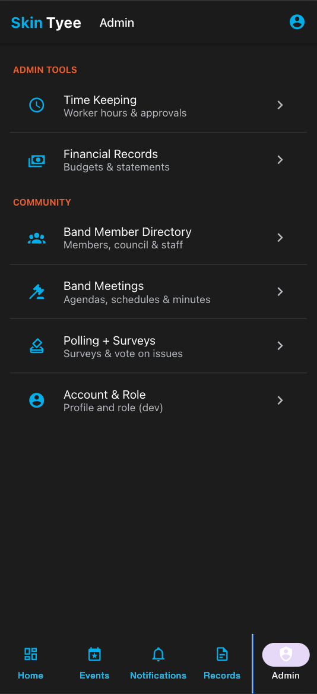
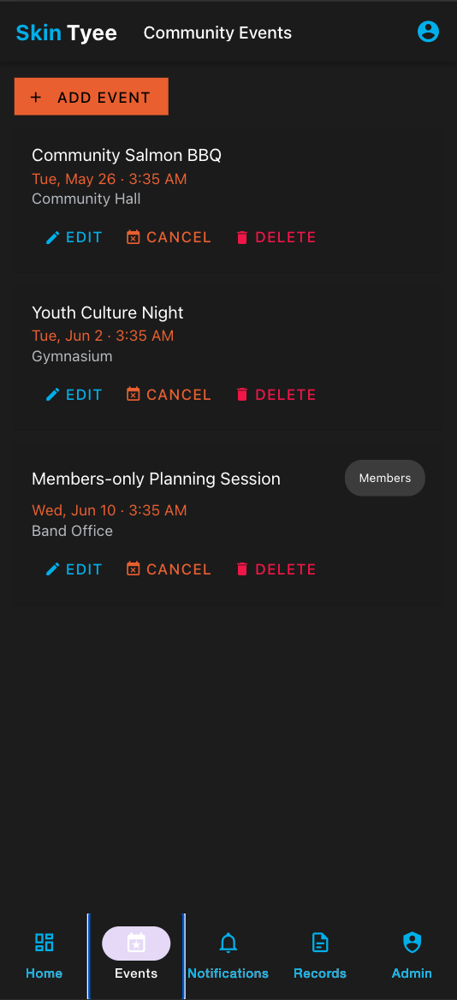
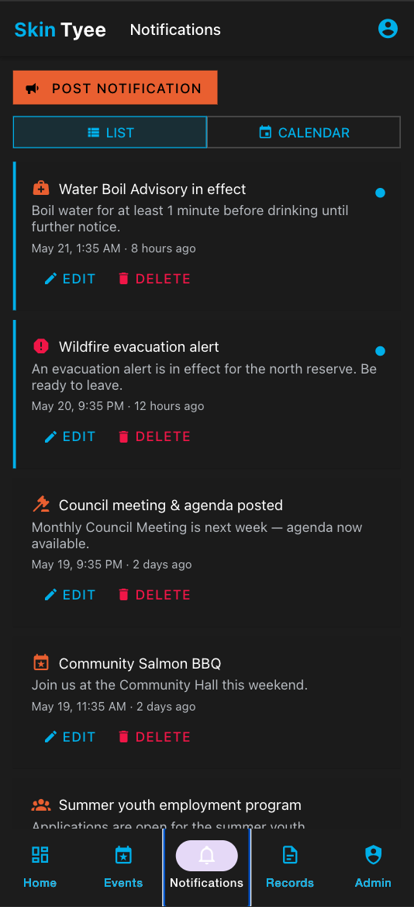
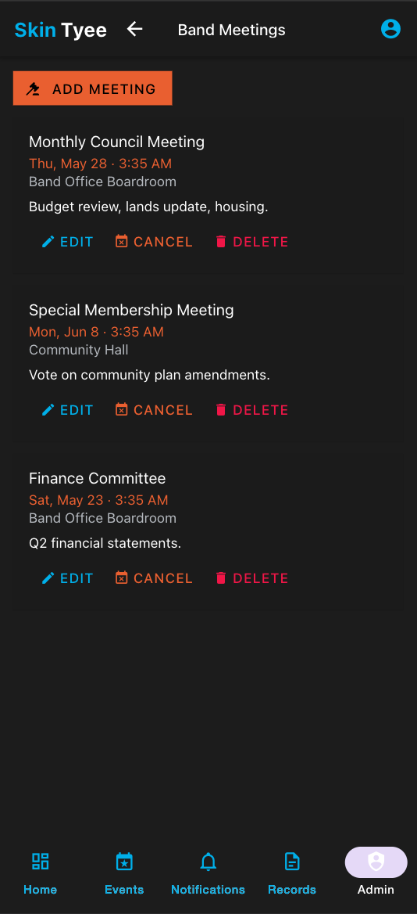
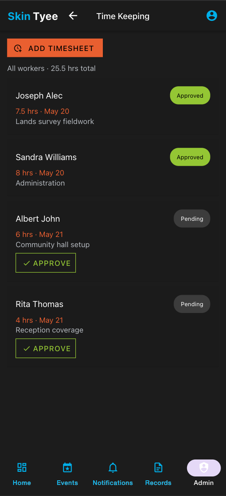

# webfront

Web presence for **Skin Tyee First Nation** — the public website (`skintyee.ca`)
and the community **app**, managed together as a pnpm workspace.

The site is a self-hosted WordPress install migrated from the previous
Site123-hosted `skintyeefirstnation.org`. The app is a React Native + Expo
proof-of-concept built for the proposal.

## Visual walkthrough

A tour of the Skin Tyee app. Screens already captured are shown; the rest are
listed with the filename to drop into [`docs/media/`](docs/media) — once a PNG is
added, replace the _pending_ note with `.png" width="240">`.

### Onboarding & navigation

| Screen | Preview | What it shows |
|---|---|---|
| Splash |  | Branded launch screen (Skin Tyee · First Nation). |
| Admin menu |  | Overflow tab for admins — Admin tools (Time Keeping, Financials) + Community. |
| More menu (non-admin) | 📸 _pending →_ `docs/media/more-menu.png` | The overflow tab for public/members (Directory, Meetings, Polls, Account). |
| Account & role switcher | 📸 _pending →_ `docs/media/account.png` | Profile + dev role switcher and the spoof-admin badge. |

### Home (Dashboard)

| Screen | Preview | What it shows |
|---|---|---|
| Dashboard (Year) |  | Admin overview, budget pie, spent-vs-allocated & per-member stats. |
| Dashboard (Month) | 📸 _pending →_ `docs/media/dashboard-month.png` | Same dashboard with the Month reporting toggle active. |

### Community

| Screen | Preview | What it shows |
|---|---|---|
| Community Events |  | Event list with admin add/edit/cancel/delete. |
| Event detail | 📸 _pending →_ `docs/media/event-detail.png` | A single event's details. |
| Create / edit event | 📸 _pending →_ `docs/media/event-form.png` | Event form incl. date/time picker + map pin. |
| Notifications (list) |  | Feed with WordPress categories; admin post/edit/delete. |
| Notifications (calendar) | 📸 _pending →_ `docs/media/notifications-calendar.png` | Month calendar marking days with notifications. |
| Post / edit notification | 📸 _pending →_ `docs/media/notification-form.png` | Notification form with category chips. |
| Band Member Directory | 📸 _pending →_ `docs/media/directory.png` | ~150-member directory list. |
| Member detail | 📸 _pending →_ `docs/media/member-detail.png` | Member contact (member+); admin edit/remove. |
| Add / edit member | 📸 _pending →_ `docs/media/member-form.png` | Member form (name, role, contact). |

### Governance

| Screen | Preview | What it shows |
|---|---|---|
| Band Meetings |  | Meetings with admin add/edit/cancel/delete. |
| Schedule / edit meeting |  | Meeting form with draggable map pin + date/time. |
| Polls (Surveys / Vote) | 📸 _pending →_ `docs/media/polls.png` | Surveys vs Vote-on-Issues toggle. |
| Poll detail | 📸 _pending →_ `docs/media/poll-detail.png` | Voting + live results bars. |

### Transparency & finance

| Screen | Preview | What it shows |
|---|---|---|
| Public Records · Transparency |  | Band expenditures by area — pie + spent-vs-budget bars. |
| Expenditure breakdown | 📸 _pending →_ `docs/media/expenditure-breakdown.png` | Drill-down: how much was spent and where. |
| Financial Records (admin) | 📸 _pending →_ `docs/media/financials.png` | Budgets, statements, grants, expenses. |

### Workforce (staff / admin)

| Screen | Preview | What it shows |
|---|---|---|
| Time Keeping |  | All workers' hours; admin approvals. |
| Add timesheet | 📸 _pending →_ `docs/media/add-timesheet.png` | Staff/admin log hours (date, hours, task). |

### Shared

| Screen | Preview | What it shows |
|---|---|---|
| Confirmation modal | 📸 _pending →_ `docs/media/confirm-modal.png` | Confirm dialog for cancel/delete actions. |

> Screenshots are from the web build; the same screens render on iOS/Android.

## Layout

```
.                      # webfront repo root + pnpm workspace
├── app/               # @skintyee/app — Skin Tyee community app (React Native + Expo)
├── api/               # @skintyee/api — API contract (OpenAPI) + stub server
├── website/           # WordPress site + migration tooling (git subtree)
├── docs/              # project + app docs, architecture decisions, proposal deck
├── package.json       # pnpm workspace root
└── pnpm-workspace.yaml
```

`website/` is vendored as a **git subtree** (not an npm package). Pull/push it
with `git subtree pull|push --prefix=website <remote> <branch>`.

## app/ — Skin Tyee community app

A React Native + Expo app (iOS, Android, web) that reuses the proven "ppt"
app stack — **React Native Paper** (Material UI, dark theme), **Redux Toolkit**
(`createAsyncThunk`), **React Navigation 6**, TypeScript.

**Features** (role-gated for Public / Band Member / Admin+Staff, from
`docs/SkinTyee.drawio.pdf`):

- **Dashboard** — community stats + budget charts (pie summary, budget-vs-actual,
  major projects) with a **Month / Year** reporting toggle.
- **Public Records → Transparency** — public band expenditures by program area
  (Housing, Public Works, Education, Health, Social Assistance, Child & Family
  Services, IT, Administration…), with drill-down breakdowns of *how much was
  spent and where*, and major-project allocated-vs-spent tracking.
- **Directory** (~150 members), **Community Events**, **Band Meetings**,
  **Notifications** (categories mirror the skintyee.ca WordPress taxonomy —
  Health / Safety / Council / Events / Programs / News / Announcements),
  **Polling + Surveys / Vote on Issues**, **Time Keeping**, **Financial Records**.

> **Proof-of-concept.** Data is mocked behind a typed `ApiService`; auth is a dev
> role switcher. Intended real services are Azure: **Entra ID** (auth),
> **Azure Blob Storage** (files), **Azure Cloud DB** + an API Server, with
> financial data from the **Ferrus ASAP Suite + Adagio / Sage 300** integration.
> Every stub is catalogued in [`app/STUBS.md`](app/STUBS.md).

```bash
pnpm --filter @skintyee/app start    # Expo dev server (press w for web)
pnpm --filter @skintyee/app typecheck
```

## api/ — Skin Tyee API (proposed)

Contract-first backend (the "API Server" in the diagram). [`api/openapi.yaml`](api/openapi.yaml)
is the source of truth — the contract the app's `ApiService` targets. `api/`
also ships a lightweight Express **stub** server (Swagger UI + sample data).

**Recommended stack:** **NestJS + Prisma + Azure Database for PostgreSQL Flexible
Server (PostGIS)**, **Entra ID** auth (role guards), Dockerized to **Azure
Container Apps** behind `api.skintyee.ca`, Azure DevOps CI. PostGIS gives
geospatial support for land allocation / GIS mapping + map pins. Full rationale:
[`api/README.md`](api/README.md) and ADR-7 in [`docs/architecture-decisions.md`](docs/architecture-decisions.md).

```bash
pnpm --filter @skintyee/api dev       # http://localhost:4000/docs (Swagger UI)
```

## Getting started

```bash
pnpm install            # install workspace dependencies

# Run the app
pnpm --filter @skintyee/app start

# Browse the API contract (Swagger UI)
pnpm --filter @skintyee/api dev

# Run the WordPress site locally (Docker)
cd website && docker compose up -d   # http://localhost:8080  (admin/admin, dev only)
```

See [`website/README.md`](website/README.md) for the full scrape → import →
export migration workflow.

## Deployment

`website/azure-pipelines.yml` deploys the WordPress stack via Azure DevOps over
SSH (`develop` → staging, `master` → production), using a **managed Azure
Database for MySQL – Flexible Server** in production
([`website/docker-compose.prod.yml`](website/docker-compose.prod.yml)).

The app distributes via **EAS Build** to **TestFlight** (iOS) and **Google Play**
(Android) — see [`docs/testing-strategy.md`](docs/testing-strategy.md).

## Documentation

- [`CLAUDE.md`](CLAUDE.md) — workspace overview, conventions, and decisions
- [`docs/app-plan.md`](docs/app-plan.md) — app build plan
- [`docs/architecture-decisions.md`](docs/architecture-decisions.md) — service ADRs (Entra ID, Azure Blob, Ferrus/Adagio, WordPress categories)
- [`docs/roadmap.md`](docs/roadmap.md) — 3-month engagement timeline
- [`docs/testing-strategy.md`](docs/testing-strategy.md) — testing + TestFlight/Google Play
- [`api/openapi.yaml`](api/openapi.yaml) — proposed API contract · [`api/README.md`](api/README.md) — API stack recommendation
- [`docs/Skintyee-App-Proposal.pptx`](docs/Skintyee-App-Proposal.pptx) — proposal deck
- [`app/STUBS.md`](app/STUBS.md) — catalogue of POC stubs
- [`docs/hosting-costs.md`](docs/hosting-costs.md) — hosting cost basis + rationale
- [`website/README.md`](website/README.md) — WordPress migration tooling

## Conventions

Default branch is `master`. Work on `feature/*` branches and merge with
`git merge --no-ff` using the subject
`Merge branch 'feature/<name>' into '<target>'`.
