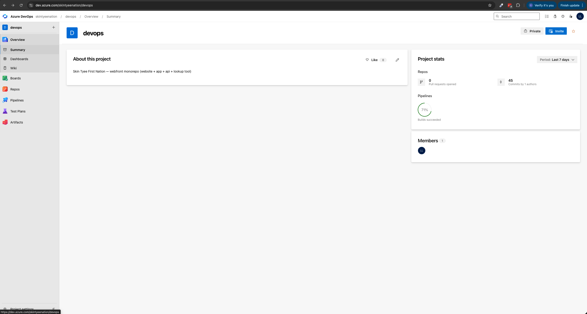
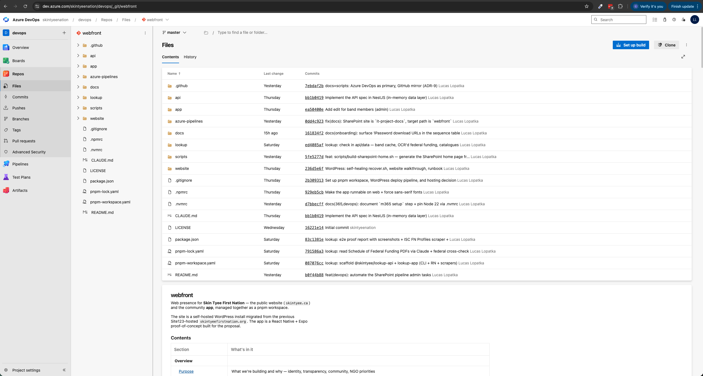
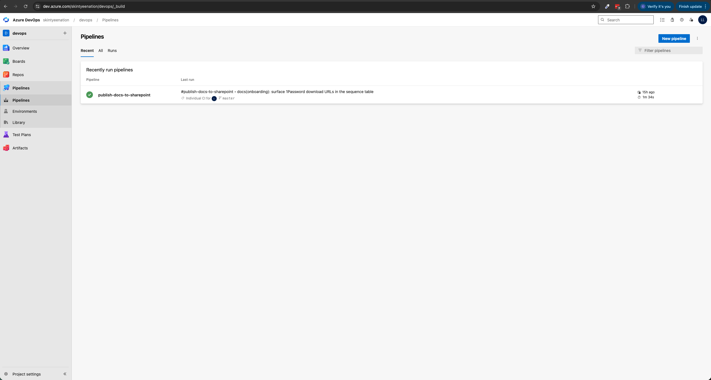

# Azure DevOps

The Nation runs its source control + CI/CD on **Azure DevOps**, with
Azure as the **primary** Git host and GitHub mirrored as a read-only
**secondary** for backup and public discoverability.

> **Organization URL:** <https://dev.azure.com/skintyeenation>
> **Project (most work happens here):** <https://dev.azure.com/skintyeenation/devops>

This section covers the setup once, plus the day-to-day "I need to
do X" runbooks.

## Where things live in Azure DevOps

The `skintyeenation` org has one project (`devops`) holding everything.
Within that project, the most-used areas are:

| Area | URL | When to go here |
|---|---|---|
| **Overview / Summary** | <https://dev.azure.com/skintyeenation/devops> | Project dashboard — Repo + Pipeline stats, members list |
| **Repos → Files (`webfront`)** | <https://dev.azure.com/skintyeenation/devops/_git/webfront> | Browse the codebase, view a file, review recent commits |
| **Repos → Pull requests** | <https://dev.azure.com/skintyeenation/devops/_git/webfront/pullrequests> | Open / review PRs |
| **Repos → Branches** | <https://dev.azure.com/skintyeenation/devops/_git/webfront/branches> | Manage feature branches, check `master` is up to date |
| **Pipelines** | <https://dev.azure.com/skintyeenation/devops/_build> | Watch the SharePoint docs publisher (and future pipelines) run |
| **Pipelines → Library** | <https://dev.azure.com/skintyeenation/devops/_library> | Variable groups (`sharepoint-docs`) + secure files |
| **Project Settings → Service connections** | <https://dev.azure.com/skintyeenation/devops/_settings/adminservices> | The `sharepoint-docs-sc` federated identity service connection |
| **Org Settings → Personal Access Tokens** | <https://dev.azure.com/skintyeenation/_usersSettings/tokens> | PAT generation (for SSH key alternatives, scripts) |
| **Boards** | <https://dev.azure.com/skintyeenation/devops/_boards> | Backlog, sprints, work items (optional — unused so far) |

### Project Overview

The Summary view shows project-wide stats — open PRs, pipeline success
rate, members. Useful at-a-glance to confirm nothing is broken.



### Repos → Files

The webfront repo's file tree. Click any folder to descend, click any
file to view it (Markdown files render inline). The README renders
below the file listing on the repo root.



### Pipelines

CI/CD runs. The **publish-docs-to-sharepoint** pipeline triggers
automatically on every push to `master` touching `docs/**`, the root
README, or the publisher script — see
[`../365/sharepoint-docs-publish.md`](../365/sharepoint-docs-publish.md)
for the auth model and
[`sharepoint-pipeline-postmortem.md`](./sharepoint-pipeline-postmortem.md)
for the gory setup history. Click a run to see step-by-step logs.



## Signing in

Use your `@skintyee.ca` work account. Single sign-on lands you straight
on the project dashboard if you've already authenticated to anything
else in the M365 tenant (Outlook, SharePoint, etc.) in the same
browser session.

If sign-in fails:

- **"Sorry, but we're having trouble signing you in"** with
  `AADSTS700016` or similar — your account isn't a member of the
  Azure DevOps organization. Ask the admin to invite you at
  <https://dev.azure.com/skintyeenation/_settings/users>.
- **"You don't have permission to access this organization"** — your
  account exists but isn't a project member. Admin adds you under the
  `devops` project's **Project Settings → Permissions**.

## SSH access (for `git push` / `git pull`)

For Git operations from the command line you'll need an SSH key
registered in Azure DevOps (or a Personal Access Token, but SSH is
nicer). One-time setup:

1. Generate a key (skip if you already have one):
   ```bash
   ssh-keygen -t ed25519 -C "firstname.lastname@skintyee.ca"
   ```
2. Add the public key to <https://dev.azure.com/skintyeenation/_usersSettings/keys> → **+ New Key**.
3. Use the SSH remote when cloning:
   ```bash
   git clone git@ssh.dev.azure.com:v3/skintyeenation/devops/webfront
   ```

Detailed walkthrough: [`azure-devops-setup.md § SSH access`](./azure-devops-setup.md).

## Why Azure DevOps as primary

- **One Microsoft identity for everything.** Same Entra ID
  `firstname.lastname@skintyee.ca` account signs into Outlook,
  Azure portal, the Skin Tyee app, *and* Azure DevOps. No separate
  GitHub login to provision/deprovision when staff turn over —
  Entra ID is the single off-switch.
- **Single billing surface.** ADO Pipelines minutes, hosted agents,
  artifact storage, and Azure subscriptions all roll up under the
  same Microsoft account as Microsoft 365 + Azure. One invoice, one
  tax record, simpler NGO accounting.
- **First-class Azure deployment.** ADO Pipelines + service
  connections give clean federated-credentials access to Azure
  Container Apps, Azure DNS, Azure Storage, Azure DB for MySQL/PostgreSQL
  — all the targets the platform already uses (the website's
  `azure-pipelines.yml` is in production today on this pattern).
- **Self-hosted agents.** The `props-agents` repo in the same
  workspace already runs ADO build agents in Docker — we can reuse
  the operational model for Skin Tyee work.

GitHub stays as a read-only mirror so the code is **publicly
discoverable** (good for the NGO transparency posture and for
youth/school collaboration noted in `/README.md § Purpose`), but
the canonical source of truth is Azure.

## What's in this section

| Doc | When you need it |
|---|---|
| [azure-devops-setup.md](./azure-devops-setup.md) | **One-time** — create the `skintyeenation` org + the `devops` project + the repo. Push existing Git history. |
| [azure-primary-github-mirror.md](./azure-primary-github-mirror.md) | **One-time** — wire the Azure → GitHub mirror push so every Azure-side merge appears on GitHub within minutes. |
| [migrate-ci-workflows.md](./migrate-ci-workflows.md) | **One-time per workflow** — port the SharePoint docs publisher (and any future GitHub Actions) into an Azure Pipeline. |
| [agents.md](./agents.md) | When ADO Pipelines minutes get expensive or you need a runner with access to the band's internal network. |
| [deploy-architecture.md](./deploy-architecture.md) | **The map** — every source tree in the monorepo, where it deploys, which pipeline + setup script + secret applies, the stand-up order, and naming conventions. The bird's-eye doc that ties ADRs 10–12 together. |
| [deploy-status.md](./deploy-status.md) | **Status** — point-in-time view of which setup scripts have run, what's blocked, the exact next command. Companion to deploy-architecture.md (steady-state vs working journal). Update after each script completes. |
| [deployment-plan.md](./deployment-plan.md) | The plan to deploy `api/` and `lookup/api/` to Azure Container Apps — compute options (with AWS equivalents), cost projection, Phase-1 stand-up steps, naming conventions. **ADR-10**. |
| [app-deploy-eas.md](./app-deploy-eas.md) | How the `app/` (and later `lookup/app/`) gets built + distributed for **native** (iOS / Android) — EAS Build (Expo hosted) orchestrated by Azure Pipelines. Build profiles, costs, signing model, ADO + EAS hybrid rationale vs full fastlane. **ADR-11**. |
| [app-deploy-web.md](./app-deploy-web.md) | How the `app/` gets built + deployed to **web** at `app.skintyee.ca` — `expo export --platform web` → Azure Static Web Apps (Free tier). PR-preview URLs, custom domain + TLS, env vars baked at build time. **ADR-12**. |

## Architectural records

- [`../architecture-decisions.md § ADR-8`](../architecture-decisions.md)
  documents the original "GitHub Actions over Azure DevOps" choice for
  the SharePoint docs publisher.
- **ADR-9** (added with this section) records the reversal —
  why we're moving the canonical repo to Azure now, and what stays
  on GitHub.

## Day-to-day after setup

Most of the time, this section is invisible: developers `git push`
to Azure, the SharePoint docs publisher runs via Azure Pipelines,
GitHub auto-mirrors. You only come back here when:

- **A new project starts** — create a new repo in the same
  `skintyeenation` org (`azure-devops-setup.md § Adding a second repo`).
- **A pipeline breaks** — debug in the ADO Pipelines UI; if the
  agent itself is the problem, see `agents.md`.
- **Onboarding a new dev** — Entra ID grants Azure DevOps access
  via the M365 group `skintyee-developers` (set up in
  `azure-devops-setup.md § Granting access to staff`).
