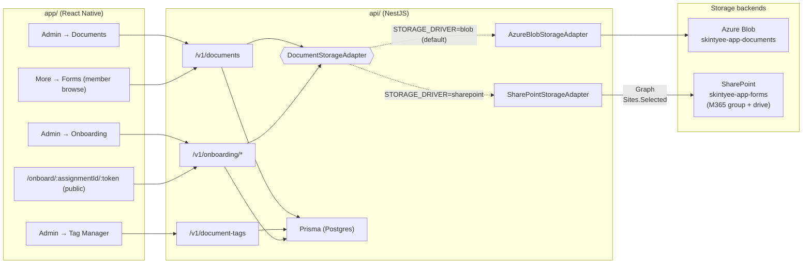
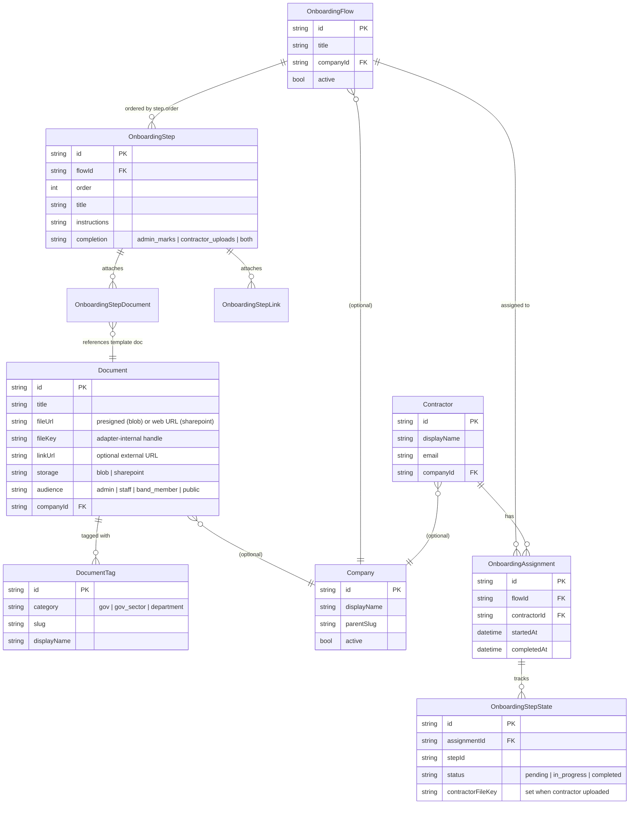

# Documents + Onboarding

Two-part feature delivering (1) an admin-managed library of band documents
(forms, gov filings, contractor packets) with a pluggable storage backend,
and (2) admin-designed onboarding flows that assemble those documents
into ordered, completable steps for contractors.

This doc is the implementation plan + ADR. Phase 1 (Documents) and
Phase 2 (Onboarding) are scoped separately and ship independently — the
Documents library is a hard dependency for Onboarding but stands on its
own as soon as it's built.

## Status

- **Phase 1 — Documents:** ✅ shipped — see commits `6b418aa` (API + storage) and `4c9f6e0` (UI screens).
- **Phase 2 — Onboarding flows:** ✅ shipped — schema, API, admin UI, public tokenised contractor link, and a seeded sample flow (one step: "Sign Non-Disclosure (NDA)" with a generated 1-page PDF attached via the active storage adapter).
- **Phase 3 — E-signatures, financial sync & audit export:** 🔵 planned — self-hosted OpenSign (ADR-17), Sage Intacct timesheet/expense sync, per-entity audit export. See [Phase 3](#phase-3--e-signatures-financial-sync--audit-export).
- A POC-grade demo is now live end-to-end. Hardenings tracked in [Open questions](#open-questions).

## System overview



### Data model (Phase 1 + Phase 2 combined)



## Decisions

Locked in before kickoff (from the planning Q&A):

| Decision | Choice | Rationale |
|---|---|---|
| Default storage adapter | **Azure Blob** | Faster to ship POC; SharePoint adapter ships alongside but behind `STORAGE_DRIVER` env switch. |
| SharePoint home | **New `skintyee-app-forms` M365 group** | Clean separation from operational docs (`it-project-docs`); provisioned via setup script. |
| Document visibility | **Per-document audience flag** | Each doc carries `audience: admin / staff / band-member / public`. Controllers + UI gate accordingly. |
| Tag seeding | **Starter values** | Pre-seed 3 categories with common Skin Tyee values (see [Tag taxonomy](#tag-taxonomy)). Admin curates from there. |

These are reversible — anything except the storage-adapter interface
itself is replaceable without a migration.

## Phase 1 — Documents

### Goals

- An **Admin → Documents** screen where admins upload PDFs and/or paste
  URLs, tag them, set audience, and assign an optional company.
- A **Tag Manager** sub-screen where admins curate the three tag
  categories (gov / gov-sector / department).
- A **storage adapter** interface so the backing store (Azure Blob today,
  SharePoint later) is a swap rather than a rewrite.
- A read view for non-admins gated by the document's `audience` flag.

### Data model

Prisma sketch (lives in `api/prisma/schema.prisma`):

```prisma
model Document {
  id          String   @id @default(cuid())
  title       String
  description String?
  // One of these is required; both is fine. A doc can be "click to view
  // online" with no PDF, or a PDF with no companion URL.
  fileUrl     String?  // canonical URL — either presigned blob URL or SharePoint web URL
  fileKey     String?  // adapter-internal handle (Blob path or SharePoint driveItem id)
  linkUrl     String?  // optional external URL (e.g. gc.ca form page)
  mimeType    String?
  sizeBytes   Int?

  // Storage adapter that owns fileKey. Set on upload, never mutated.
  storage     DocumentStorage  // 'blob' | 'sharepoint'

  // Per-doc visibility — controller filters list/detail responses by
  // the caller's role. Upload + edit always admin-only.
  audience    DocumentAudience @default(staff)

  // Disabled in the UI for Phase 1 — slot held for the eventual Company
  // model. Nullable until Company is implemented.
  companyId   String?
  // company  Company? @relation(fields: [companyId], references: [id])

  tags        DocumentTag[]  // M:N via implicit join

  createdAt   DateTime @default(now())
  createdBy   String   // UPN of uploading admin
  updatedAt   DateTime @updatedAt
}

enum DocumentStorage {
  blob
  sharepoint
}

enum DocumentAudience {
  admin
  staff
  band_member
  public
}

model DocumentTag {
  id          String   @id @default(cuid())
  category    TagCategory  // 'gov' | 'gov-sector' | 'department'
  slug        String   // kebab-case, unique within category
  displayName String
  documents   Document[]

  @@unique([category, slug])
}

enum TagCategory {
  gov
  gov_sector
  department
}

// Phase 1 placeholder — not yet exposed in UI.
model Company {
  id          String  @id @default(cuid())
  displayName String
  parentSlug  String  // sub-company of 'skintyee-management'
  active      Boolean @default(true)
  documents   Document[]
}
```

Notes:
- `fileKey` is the adapter-internal handle; `fileUrl` is the
  canonical URL the client uses to view/download. Two fields because
  the Blob adapter rebuilds presigned URLs on every read (the key is
  stable, the URL isn't), while SharePoint serves long-lived web URLs.
- Documents can carry **either** a PDF, **or** a URL, **or** both —
  the controller validates at least one of `fileKey` / `linkUrl`.

### Storage adapter interface

`api/src/storage/document-storage.ts`:

```ts
export interface DocumentStorageAdapter {
  driver: 'blob' | 'sharepoint';

  // Upload + return the adapter-internal key + the canonical URL.
  upload(input: {
    fileName: string;
    mimeType: string;
    bytes: Buffer;
  }): Promise<{ key: string; url: string }>;

  // Return a (possibly fresh, possibly long-lived) download URL for an
  // existing key. Blob: regenerates a presigned URL on each call.
  // SharePoint: returns the stored web URL (long-lived).
  urlFor(key: string): Promise<string>;

  // Delete by key. Idempotent — no error if already gone.
  delete(key: string): Promise<void>;
}
```

Two implementations:

- **`AzureBlobStorageAdapter`** — Phase 1 default. Container
  `skintyee-app-documents` on the existing `skintyeebackups`-adjacent
  storage account (or a new account; see [Setup work](#setup-work)).
  Presigned URLs with 30-minute TTL.
- **`SharePointStorageAdapter`** — Phase 1 ships the code but is **off**
  by default. Targets the new `skintyee-app-forms` M365 group's
  Documents library. Uses Graph
  `/groups/{id}/drive/root/children/{name}/content` for upload and
  `webUrl` for download.

Selection at boot:

```ts
const STORAGE_DRIVER = process.env.STORAGE_DRIVER ?? 'blob';
// Wired in the Nest module factory; controllers depend on the interface.
```

### Tag taxonomy

Seeded values (idempotent seed script — re-running won't dupe):

- **`gov`** — single-value category, acts as a binary "this is a
  government doc" flag. Just one tag: `gov` (slug + displayName "Gov").
- **`gov-sector`** — multi-value. Seed:
  - `indigenous-services` → "Indigenous Services"
  - `health` → "Health"
  - `natural-resources` → "Natural Resources"
- **`department`** — multi-value. Seed (mirrors existing Skin Tyee
  departments from `skintyee-groups.ts`):
  - `housing` → "Housing"
  - `forestry` → "Forestry"
  - `finance` → "Finance"
  - `gis` → "GIS"

Tag Manager UI lets admins add / edit / delete entries in any
category. Deleting a tag with attached documents is blocked
(`409 Conflict` with a list of affected document titles).

**In-use signalling.** `GET /v1/document-tags` returns
`inUseCount: number` on every tag — the live count of documents
referencing it. The Tag Manager UI renders this two ways:

  - **Badge** next to the tag name: `Housing · 3 docs` when
    `inUseCount > 0`; nothing when zero (avoids visual noise).
  - **Delete button disabled** when `inUseCount > 0`, with a
    tooltip / HelperText explaining "remove from N document(s)
    first". Tapping the badge filters the Documents list to docs
    carrying this tag, so the admin can clean them up in one
    place before retrying delete.

This is purely a UX courtesy — the server-side `409` guard stays
in place as the authoritative gate. The UI just surfaces the
state up-front so admins don't have to click-discover it.

### API surface

All under `/v1/documents` + `/v1/document-tags`. Auth: Bearer
Entra token; role guards as marked.

| Method | Path | Roles | Purpose |
|---|---|---|---|
| GET    | `/v1/documents` | gated by audience | List visible docs; query `?tag=slug&category=...&search=...` |
| GET    | `/v1/documents/:id` | gated by audience | Detail (resolves a fresh URL via the adapter) |
| POST   | `/v1/documents` | admin | Upload (multipart) or paste a link |
| PATCH  | `/v1/documents/:id` | admin | Title / description / tags / audience / linkUrl |
| DELETE | `/v1/documents/:id` | admin | Drops the row + asks the adapter to delete the file |
| GET    | `/v1/document-tags` | any signed-in | Catalog for the picker |
| POST   | `/v1/document-tags` | admin | Add a tag |
| PATCH  | `/v1/document-tags/:id` | admin | Rename / re-slug |
| DELETE | `/v1/document-tags/:id` | admin | Delete (409 if in use) |

Audience gating:

| Caller role | Sees `admin` | `staff` | `band-member` | `public` |
|---|---|---|---|---|
| admin | ✓ | ✓ | ✓ | ✓ |
| staff | — | ✓ | ✓ | ✓ |
| band-member | — | — | ✓ | ✓ |
| public (unauthenticated) | — | — | — | ✓ |

### UI surface (`app/`)

New screens, gated by role on the route stack:

- **`Documents.tsx`** (admin tab card → list) — searchable list
  with chip filters for the three tag categories. Add button opens
  `AddDocument`. Tap row → `DocumentDetail`.
- **`AddDocument.tsx`** (admin only) — title, description, PDF
  upload (Expo `DocumentPicker` → multipart POST), link URL,
  tag picker (multi-select per category), audience dropdown,
  Company dropdown (**disabled, "Coming soon"**).
- **`EditDocument.tsx`** (admin only) — same form, PATCH on save.
- **`DocumentDetail.tsx`** — read-only view with Open / Download /
  Open link buttons; gated by audience.
- **`TagManager.tsx`** (admin only) — three sections (one per
  category) with add/edit/delete rows. Modal for create/edit.

Member-visible browsing: a read-only `Documents` tab is added to
the More menu for `band-member` / `staff`, surfacing audience-
gated docs. Public docs surface for unauthenticated viewers too
(future website integration).

### Setup work

- **Azure Blob container** — `skintyee-app-documents` on the
  `skintyeeprod` storage account. Setup script:
  `scripts/setup-app-documents-blob.sh` (idempotent). Wires
  SAS credentials into the `api-prod` Container App as
  `AZURE_STORAGE_DOCUMENTS_*`.
- **SharePoint `skintyee-app-forms` M365 group** — provisioned by
  `scripts/setup-app-forms-sharepoint.sh`. Adds the group to
  `skintyee-groups.ts` catalog (`kind: 'm365'`, no `mail` — not
  invitable to meetings). Grants the `skintyee-app-graph` app
  `Sites.Selected` on the new site. Phase 1 ships this script but
  the SharePoint adapter stays disabled until the script is run.

### Out of scope for Phase 1

- Versioning (replace = overwrite for now)
- Bulk import
- OCR / full-text search of PDF contents
- Per-tag access control (audience is per-doc only)
- Company UI (placeholder column only)

---

## Phase 2 — Onboarding flows

### Goals

- An **Admin → Onboarding** area where admins design reusable
  onboarding flows: ordered steps, each with attached documents,
  external URL links, and acceptance criteria.
- A flow assigned to a **group of contractors** (passive link —
  contractors don't get accounts in Phase 1; admin just tracks
  progress on their behalf, with optional contractor accounts in a
  future phase).
- The contractor can **re-upload** documents per step (e.g. signed
  forms); the admin can **mark complete**.

### Data model

```prisma
model OnboardingFlow {
  id          String   @id @default(cuid())
  title       String
  description String?
  companyId   String?  // optional — same placeholder as Document
  active      Boolean  @default(true)
  steps       OnboardingStep[]
  assignments OnboardingAssignment[]
  createdAt   DateTime @default(now())
  createdBy   String
  updatedAt   DateTime @updatedAt
}

model OnboardingStep {
  id          String   @id @default(cuid())
  flowId      String
  flow        OnboardingFlow @relation(fields: [flowId], references: [id], onDelete: Cascade)
  order       Int
  title       String
  instructions String?  // markdown
  // Attached resources — pointers to Document rows + free URL links.
  documentLinks OnboardingStepDocument[]
  links       OnboardingStepLink[]
  // Acceptance: which side completes this step?
  completion  StepCompletion // admin_marks | contractor_uploads | both
}

enum StepCompletion {
  admin_marks
  contractor_uploads
  both
}

model OnboardingStepDocument {
  id          String   @id @default(cuid())
  stepId      String
  step        OnboardingStep @relation(fields: [stepId], references: [id], onDelete: Cascade)
  documentId  String
  document    Document @relation(fields: [documentId], references: [id])
  contractorUploadAllowed Boolean @default(false)
}

model OnboardingStepLink {
  id          String   @id @default(cuid())
  stepId      String
  step        OnboardingStep @relation(fields: [stepId], references: [id], onDelete: Cascade)
  label       String
  url         String
}

// One contractor going through one flow. Contractors are not band
// members → we don't reuse BandMember; instead a thin Contractor row
// is enough for Phase 2. Account creation is future work.
model Contractor {
  id          String   @id @default(cuid())
  displayName String
  email       String?
  phone       String?
  companyId   String?
  assignments OnboardingAssignment[]
  createdAt   DateTime @default(now())
}

model OnboardingAssignment {
  id           String   @id @default(cuid())
  flowId       String
  flow         OnboardingFlow @relation(fields: [flowId], references: [id])
  contractorId String
  contractor   Contractor @relation(fields: [contractorId], references: [id])
  startedAt    DateTime @default(now())
  completedAt  DateTime?
  stepStates   OnboardingStepState[]
}

model OnboardingStepState {
  id              String   @id @default(cuid())
  assignmentId    String
  assignment      OnboardingAssignment @relation(fields: [assignmentId], references: [id], onDelete: Cascade)
  stepId          String
  // Either the admin marks complete, or the contractor uploaded the
  // required docs (replacing the template Document refs).
  status          StepStatus @default(pending)
  contractorFileKey String?  // present when contractor uploaded — adapter key
  contractorFileUrl String?
  notes           String?
  completedAt     DateTime?
  completedBy     String?    // UPN or "contractor"
}

enum StepStatus {
  pending
  in_progress
  completed
}
```

### API surface

| Method | Path | Roles | Purpose |
|---|---|---|---|
| GET    | `/v1/onboarding/flows` | admin | List flow templates |
| POST   | `/v1/onboarding/flows` | admin | Create |
| PATCH  | `/v1/onboarding/flows/:id` | admin | Update title/description/order |
| DELETE | `/v1/onboarding/flows/:id` | admin | Delete (cascades steps) |
| POST   | `/v1/onboarding/flows/:id/steps` | admin | Add step |
| PATCH  | `/v1/onboarding/steps/:id` | admin | Update step |
| DELETE | `/v1/onboarding/steps/:id` | admin | Delete step |
| GET    | `/v1/onboarding/contractors` | admin | List contractors |
| POST   | `/v1/onboarding/contractors` | admin | Add contractor |
| POST   | `/v1/onboarding/contractors/:id/assignments` | admin | Assign a flow |
| GET    | `/v1/onboarding/assignments/:id` | admin (or contractor link) | View progress |
| POST   | `/v1/onboarding/assignments/:id/steps/:stepId/complete` | admin | Mark complete |
| POST   | `/v1/onboarding/assignments/:id/steps/:stepId/upload` | admin or contractor link | Contractor upload |

### UI surface

The onboarding screens **borrow the existing timesheets visual language**
(see [`docs/features/timesheets.md`](timesheets.md) +
`app/src/components/pages/TimeKeeping.tsx` + `AddTimesheet.tsx`).
Reusing what the user already knows means we ship faster and stay
visually consistent with the rest of the app. Specifically:

- **Card-per-step layout** — mirrors the per-day cards in
  AddTimesheet (one card per pay-period day). Each onboarding step
  is its own dark `Card` with a row of metadata + the body.
- **Status chip pattern** — same `statusColor` palette as
  timesheets (`approved`/`completed` → success, `rejected` → error,
  `submitted`/`in_progress` → accent, `draft`/`pending` →
  secondary). Reuse the chip styling.
- **My / Approvals two-tab layout** — `TimeKeeping.tsx`'s
  `SegmentedButtons` of "My timesheet | Approvals" maps directly
  to "My flows | Approvals" on the admin onboarding screen (an
  admin reviewing contractor uploads is the same UX as an admin
  reviewing a timesheet).
- **Approval row** — `ApprovalCard` in TimeKeeping (name + status
  chip + total + Approve / Reject / info-modal) is the template
  for an admin marking a step complete or rejecting a contractor
  upload. Reuse the same compact row + modal detail pattern.
- **Toast on save / submit** — the same Snackbar pattern
  AddTimesheet uses for "Saved" / "Submitted for approval" applies
  to "Step marked complete" / "Upload rejected" feedback.
- **HelperText reasons** — rejection reasons render as
  `<HelperText type="error">` exactly like the timesheet rejection
  copy.
- **Detail modal** — read-only modal for inspecting a step's
  contractor upload mirrors `TimesheetDetailModal` (status header,
  prominent notes, metadata footer).
- **Cut-off / due-date countdown** — onboarding flow due dates
  can use the same "X days away" pattern Dashboard uses for the
  pay-period countdown.

Concrete screens:

- **`OnboardingFlows.tsx`** (admin) — list flows; reorder steps via
  drag handle; clone flow. Each flow row shows a progress chip
  styled like the timesheet status chip.
- **`EditOnboardingFlow.tsx`** (admin) — Add Step button; each step
  is a dark Card matching the AddTimesheet day-card style, with
  attached Document(s) + URL link(s) + the `completion` dropdown.
- **`Contractors.tsx`** (admin) — list / add. Assign flow opens a
  modal sized + styled like the invitees modal on EditMeeting.
- **`AssignmentTimeline.tsx`** (admin) — read view of a single
  assignment's step-by-step progress. Top half = `MyTimesheetView`
  shape (summary card + history list); bottom half = approvals
  list when the admin needs to review contractor uploads.
- **`OnboardingApprovals.tsx`** (admin) — pending contractor
  uploads across all flows. One row per upload, using the same
  `ApprovalCard` skeleton with Approve / Reject / info-modal
  buttons. Admin → always; staff with the right band-group →
  delegated approval (mirrors the OT-needs-admin rule from
  timesheets).

Contractor-facing link (passive): a public, tokenised URL
`/onboard/:assignmentId/:token` shows the assignment timeline
without requiring auth. Used to share a "click here to upload
your forms" link by email. Phase 2 only ships the read view +
contractor upload; full auth is a future-work item.

### Out of scope for Phase 2

- Email notifications when steps complete (use Mailgun later)
- Contractor-side accounts / auth
- Bulk assignment to a group of contractors
- Step deadlines / reminders
- Workflow approval branching (linear flows only)

---

## Build order

Roughly two iterations. Each one is a single PR + branch.

### Iteration 1 — Documents (Phase 1)

1. **Schema + migration** — add Document, DocumentTag, DocumentStorage,
   DocumentAudience, TagCategory, Company. Run seed for the 4 tag
   categories with starter values.
2. **Storage adapter interface** — `DocumentStorageAdapter` +
   `AzureBlobStorageAdapter` (live) + `SharePointStorageAdapter`
   (off by default).
3. **Setup script** — `scripts/setup-app-documents-blob.sh` for
   the Blob container + SAS wiring; `scripts/setup-app-forms-sharepoint.sh`
   for the future SharePoint provisioning (ships, not run yet).
4. **API endpoints** — `/v1/documents/*` + `/v1/document-tags/*` with
   role + audience gating.
5. **Admin UI** — Documents list / Add / Edit / TagManager.
   Documents tab added under the existing Admin stack.
6. **Member browse UI** — read-only Documents card on More menu,
   audience-filtered.

### Iteration 2 — Onboarding (Phase 2)

1. **Schema + migration** — add OnboardingFlow / Step / Contractor /
   Assignment / StepState models.
2. **API endpoints** — `/v1/onboarding/*` with admin gating + the
   tokenised contractor link.
3. **Admin UI** — OnboardingFlows list, EditOnboardingFlow,
   Contractors, AssignmentTimeline.
4. **Contractor link page** — public timeline + upload (no auth).
5. **Documentation** — onboarding admin runbook in `docs/onboarding/`.

## Phase 3 — E-signatures, financial sync & audit export

Phase 3 reframes Documents+Onboarding as a full **electronic document storage &
retrieval portal** with three external integrations. Decision + cited compliance:
**[ADR-17](../architecture-decisions.md)** + **[esign-compliance.md](../esign-compliance.md)**.
**Status: planned.**

**The portal, end to end:**
- **SharePoint** stores the files (signed PDFs, supporting invoices/receipts,
  policies); the **app** retrieves/manages them (role-gated). SharePoint = $0
  incremental (already in M365).
- **OpenSign** (self-hosted, `esig.skintyee.ca`) is the **e-signature component**
  for the *signature ceremony* — onboarding/NDA/policy acknowledgements, TD1/TD1BC.
  Sealed PDF + certificate of completion → SharePoint. Setup:
  [esign-opensign-runbook.md](../esign-opensign-runbook.md); cost:
  [esign-costs.md](../esign-costs.md).
- **Sage Intacct** is the **financial backend** for AP/AR, EFTs, and the
  audit-logged approval of **timesheets + expenses**.

**Timesheet / expense sync (the seat-avoidance design):**
- Intacct seats are expensive, so **not everyone gets one.** Only ~10 finance/admin
  staff have Intacct accounts. The potentially **hundreds of contractors** and
  growing band staff **self-track timesheets + expenses in the app** (its own
  tables), which get **approved and submitted to Intacct via a sync service**.
- This is the rationale for the **Sage Intacct sync stub** (api/) — the app is the
  front-end of record for time/expense capture; Intacct is the accounting backend.
  Sync maps the app's records to Intacct `TIMESHEET`/`TIMESHEETENTRY` and
  `EEXPENSES`/`EEXPENSESITEM` objects via the XML Web Services gateway (stubbed in
  the POC). Cost basis: `sage-intacct-costs.md` (in progress).

**Audit export (per entity):** for any given entity — vendor, employee, program,
funding agreement — the app can **generate/trigger an export** of the full
documentation a federal auditor needs: SharePoint documents **+** the linked
Intacct financial records (approvals, audit trail, proof of payment), assembled
into one package. Retention basis: **6 yr** CRA ([keeping records — ITA s.230 /
IC78-10R5](https://www.canada.ca/en/revenue-agency/services/tax/businesses/topics/keeping-records.html)),
longer per [ISC funding agreement](https://www.rcaanc-cirnac.gc.ca/eng/1770316369535/1770316482534)
or [FNFMA](https://laws-lois.justice.gc.ca/eng/acts/F-11.67/) — see
[esign-compliance.md §5](../esign-compliance.md#5-document--approval-responsibility-matrix).

## Open questions

- **Company catalog** — when ready to enable, where does the
  catalog live? Manual table? Sourced from Entra (one M365 group
  per company)?
- **Contractor accounts** — Entra B2B vs custom auth vs
  tokenised-link-only forever. Probably tokenised links suffice
  for now; B2B if we want SSO with their work accounts later.
- **Versioning** — when a doc is updated, do existing assignments
  pin the old version or follow the new one? Phase 2 will likely
  freeze the doc reference at assignment time.

## References

- ADR — to be added to [`docs/architecture-decisions.md`](../architecture-decisions.md)
  once Iteration 1 lands ("ADR-15: Documents + Onboarding").
- Existing storage patterns:
  [`docs/365/sharepoint-docs-publish.md`](../365/sharepoint-docs-publish.md)
  — `Sites.Selected` + Graph upload (same approach we'll reuse
  for the SharePoint adapter).
- Tag catalog ancestor:
  [`api/src/skintyee-groups.ts`](../../api/src/skintyee-groups.ts)
  — pattern for an in-code catalog with a UI manager (Tag Manager
  will follow the same shape if we end up moving tags from DB to
  a code catalog later).
