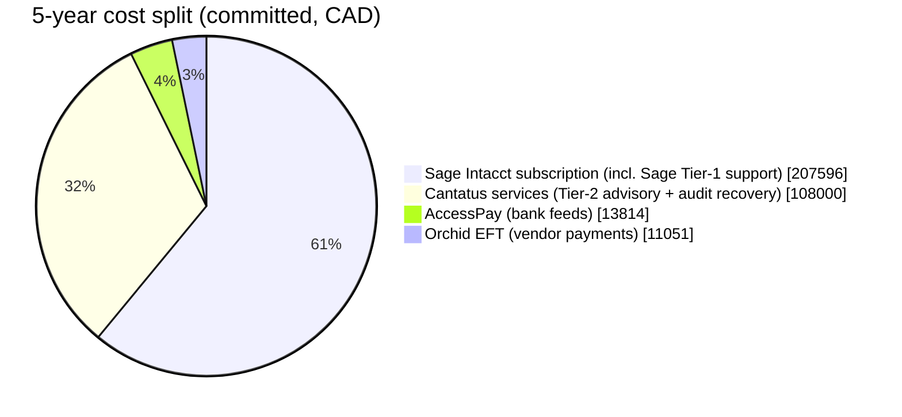
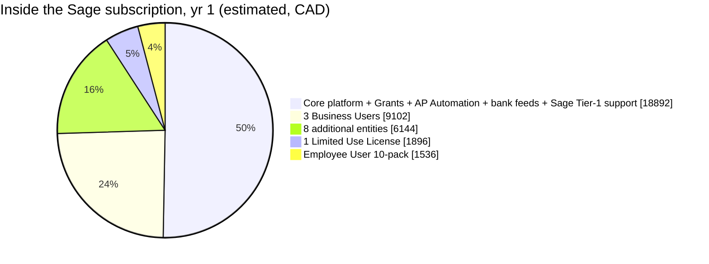

# Sage Intacct cost record — financial backend (~10 users)

**Purpose:** cost basis for **Sage Intacct** as the band's financial system of
record (AP/AR, EFTs, audit-logged approvals) — the backend the app's timesheet
and expense data syncs into. Architecture + compliance: **ADR-17** and
[`esign-compliance.md`](esign-compliance.md) §5. One-page summary:
[`pricing-overview.md`](pricing-overview.md).

Ordinary operating expense, **100% tax-deductible** (current expense — same s.9 /
s.18(1)(a) framing as the other infra). Not tax/accounting advice.

> ⚠️ **Sage Intacct is quote-only.** Sage publishes **no list price** — every
> figure below is a **third-party market estimate** (resellers/VARs: Cargas, Rand
> Group, RKL eSolutions, gotomyerp; aggregators: ERP Research, G2). Figures
> cluster tightly enough to plan against, but **an exact number needs a partner
> quote** (Canadian VARs — e.g. MNP Digital — quote in CAD). Last researched
> 2026-06.

## The cost lever — why the app + sync matters most

Sage Intacct is **named-user** licensed, in two tiers:

| User type | Access | For | Per-user estimate (CAD) |
|---|---|---|---|
| **Business User** | Full financials (GL/AP/AR/Cash, reporting) | Finance/admin staff | **~\$540–\$1,090/user/mo** (~\$6,500–\$13,000/yr) ≈ US \$400–800/mo · ⚠️ low-confidence, single-sourced & derived |
| **Employee User** (sold in 10-packs) | Read-only + **enter timesheets / expenses** only | Self-service staff | **No public per-seat rate** — quote-only; much cheaper, sold in 10-packs |
| **API integration user** (our design) | none — the app writes on their behalf | the hundreds of contractors | **\$0** — they are never Intacct named users |

> **Per-user caveat:** resellers quote **packages, not per-seat** — 10 *full*
> Business Users at the directional rate implies ~\$65k–\$130k CAD/yr in seats
> alone, but real deployments **blend** a few full users with cheap Employee packs
> (the ~\$34k-CAD anchor config = 5 Business + 10 Employee). **Use the package
> total in the estimate table below, not per-seat × 10.**

**There is no free time/expense-entry tier inside Intacct** — anyone whose data
lands *directly* in Intacct must be a licensed (even if cheap) user. So if
hundreds of contractors entered time/expense **in Intacct**, each would need an
Employee-User seat (e.g. 200 contractors ≈ 20 ten-packs).

**Our architecture avoids that entirely:** contractors and most staff enter
time/expense in **our app**, which writes to Intacct over the **API integration
(a single service/integration user)** on approval. The potentially **hundreds of
contractors are never Intacct named users** — we stay at **~10 Business Users +
the integration**. This is the single biggest cost lever in the whole estimate.
(Confirm the API/integration-user licensing in the quote.)

## Estimated cost — ~10 Business Users, Core Financials + Time & Expense

**CAD** — FX-converted from USD market estimates (~1.36). Canadian VARs (e.g. MNP
Digital) quote **directly in CAD**, so **treat a CAD partner quote as the real
figure**, not a USD×FX conversion. Estimates, not a quote.

| Line item | Estimate (CAD) | Notes |
|---|---|---|
| Core Financials (GL/AP/AR/Cash, 1 entity) | **~\$12,000–\$20,000/yr** (modal ~\$16k) | ≈ US \$9k–\$15k; 5 independent sources |
| ~10 Business Users + Time & Expense module | bundled into total below | Time & Expense ≈ ~\$4k–\$14k (advanced-module band) |
| **Annual subscription (all-in, ~10 users)** | **~\$27,000–\$55,000/yr** | toward ~\$60k if all 10 are full-access seats; anchor: a "5 Business + 10 Employee + 2 entities" config ≈ ~\$34k (US \$25k) |
| **Implementation (one-time, via partner)** | **~\$27,000–\$55,000** | ~1.0–1.5× year-one subscription; small/clean ~\$14k–\$41k; ~4–12 weeks |
| **Year 1 all-in** | **~\$54,000–\$110,000** | subscription + implementation |
| **Ongoing (year 2+)** | **~\$27,000–\$55,000/yr** | subscription only |
| Extra legal entities | + per-entity surcharge | first entity included; each extra billed |

> ⚠️ CAD figures are mechanical ~1.36 FX conversions of USD market estimates — a
> **Canadian VAR quote (in CAD) is the authoritative number** (Intacct is sold in
> CAD with a Montreal data centre).

## Where this deal sits — provider / cost spectrum

The **actual vendor quote** (Cantatus, Quote Q-920627) is recorded in
[`sage-intacct-cantatus-response.md`](sage-intacct-cantatus-response.md). Here is
where it lands against the alternatives — all CAD, estimates pending firm quotes:

| Option | Software / yr | Services | 5-yr ballpark | What you get |
|---|--:|--:|--:|---|
| **Sage 300** (current/legacy — cheapest sticker) | ~\$25–45k/yr hosted (10 users) | impl ~\$15–50k; **historical recovery extra** | ~\$140–270k+ | Legacy/on-prem ERP. **No** non-profit discount, weaker fund/multi-entity reporting, support unbundled, no clean FMB path. |
| **Sage Intacct — direct / market** | ~US \$15–35k (~CAD \$20–48k) | impl ~1.0–1.75× yr-1 | ~\$160–330k | Cloud, non-profit-endorsed fund accounting; **bare** small-deployment config. |
| **This deal (Cantatus + Intacct)** | **\$37,570/yr** (9 entities, grants, mixed users; **33.8%** off) | **\$108k fixed / 2 yr** incl. **multi-year audit recovery** + training | **~\$340–355k** | Intacct **+ reconstruction of ~4–5 yrs of books for audit across 9 entities + FMB-oriented capacity building + 2-yr managed advisory**, fixed-fee. |

*Sage 300 figures: IWI Consulting, BAASS, ERP Research (quote-only estimates). No
non-profit discount exists for Sage 300 — only Intacct carries the 20% Sage
Foundation discount.*

**Verdict — middle-to-upper-middle of the spectrum, and defensible:**

- **Software (the Intacct subscription, ~\$37,570/yr): fair / market — not high.**
  The cost driver is the **9-entity multi-entity structure + grants module**, not
  padding, and the **33.8% discount beats the standard 20% NFP rate**. A bare
  single-entity Intacct is cheaper but wouldn't match the Nation's entity structure.
- **Services (\$108k / 2 yr): priced for the scope, not a vanilla install.** A
  plain Intacct implementation is ~\$27–55k — this is **~2–4× that**, but it bundles
  **multi-year historical reconstruction for audit across 9 entities + audit-
  readiness + training + 2 years of advisory**, on a **fixed fee that absorbs the
  recovery risk**. A CPA firm rebuilding years of damaged books easily justifies the
  premium — and you'd pay for that recovery under *any* platform, including Sage 300.
- **vs Sage 300 (cheapest sticker):** Sage 300 looks ~half the software cost, but
  it's **legacy, has no non-profit discount, weaker multi-entity/fund reporting,
  still needs the same expensive historical recovery, and doesn't advance FMB
  certification**. The Intacct premium buys the platform built for what the Nation
  is trying to become.

**Bottom line: you are not overpaying for software** (it's market, better-than-
standard discount) **and the services premium is justified by a heavy
audit-recovery scope** you'd incur anywhere. **The real lever is the 5-year term,
not the rate** — managed terms of 60 months sit outside the 1–3-yr industry norm,
so the negotiation should target a **CPI-capped escalator, a clean exit + data-
portability clause, and itemized line items** (the vendor's response already
concedes data ownership, Canadian residency, and openness on exit terms). Term
trade-off detail: see the [Cantatus response §G + Supporting Exhibit](sage-intacct-cantatus-response.md).

### Where the money goes

**5-year total (committed basis, ~\$340k CAD).** Sage's **Tier-1 support is bundled
into the subscription**; **Cantatus is the Tier-2** advisory / implementation /
audit-recovery layer. So ~two-thirds is software (Sage) and ~one-third is services
(Cantatus):

| Slice (committed basis) | Y1 | Y2 | Y3 | Y4 | Y5 | 5-yr | Share |
|---|--:|--:|--:|--:|--:|--:|--:|
| Sage Intacct subscription (incl. Tier-1 support) | 37,570 | 39,448 | 41,420 | 43,492 | 45,666 | 207,596 | ~61% |
| Cantatus services (Tier-2, committed 2-yr) | 72,000 | 36,000 | — | — | — | 108,000 | ~32% |
| AccessPay (bank feeds, base) | 2,500 | 2,625 | 2,756 | 2,894 | 3,039 | 13,814 | ~4% |
| Orchid EFT (vendor payments) | 2,000 | 2,100 | 2,205 | 2,315 | 2,431 | 11,051 | ~3% |
| **Annual total (committed, low)** | **114,070** | **80,173** | **46,381** | **48,701** | **51,136** | **340,461** | 100% |

*Software lines escalate at Sage's 5%/yr cap. Cantatus's committed fee is front-
loaded into Years 1–2; Years 3–5 show \$0 committed (optional advisory renewals
add +\$36k/yr Year 3, +\$18k/yr Years 4–5 = +\$72k if elected). Excludes one-time
AP-Automation catch-up (~\$3–6k), taxes, and disbursements.*

**Inside the annual Sage subscription (\$37,570/yr) — estimated** from the order-
schedule per-unit rates (Cantatus response §E; the "core + support" slice is the
residual, since the schedule gives unit rates but not a full line-item split):

| Component | CAD/yr | Share |
|---|--:|--:|
| Core platform + Grants module + AP Automation + bank feeds + **Sage Tier-1 support** | ~18,892 | ~50% |
| 3 Business Users (@ ~\$3,034) | ~9,102 | ~24% |
| 8 additional entities (@ ~\$768) | ~6,144 | ~16% |
| 1 Limited Use License | ~1,896 | ~5% |
| Employee User 10-pack | ~1,536 | ~4% |

## Non-profit discount

- **Sage Foundation "NPO Success" → ~20% off Sage Intacct** (excludes the Intacct
  *Starter* edition), validated through partner **Percent** —
  [Canada NPO Success page](https://www.sage.com/en-ca/company/sage-foundation/products/)
  · [UK page (confirms the 20% Intacct line)](https://www.sage.com/en-gb/company/sage-foundation/products/).
  **Apply via Percent to confirm the specific band entity qualifies** — probable,
  not automatic.
- **TechSoup / TechSoup Canada does NOT donate or discount Sage Intacct** — its
  [Sage program](https://www.techsoup.org/sage) is payment-processing only, and
  [TechSoup Canada](https://www.techsoup.ca/) lists no Sage product. The discount
  path is Sage Foundation/Percent, a separate channel — don't conflate them.

## Canada & First Nations fit

- **Officially served in Canada:** Sage Intacct has a **Canadian data centre**
  (AWS Montreal, since 2021) for data residency, native **CAD**, CRA tax support
  (GST/HST/PST, T5018), accredited Canadian VARs (MNP Digital, etc.).
- **First Nations precedent:** **Mattagami First Nation** migrated **Sage 300 →
  Sage Intacct** (via MNP Digital) and used it toward **First Nations Financial
  Management Board (FMB) certification** — the closest analog to Skin Tyee.
- ⚠️ **Standards gap to flag:** Canadian bands report under **PSAS** (Public
  Sector Accounting Standards), audited consolidated statements within 120 days
  of year-end — **not** US FASB/GASB. Intacct's out-of-box nonprofit templates
  are FASB-958-oriented, so **PSAS / FMB reporting leans on dimensions + partner
  configuration** (the Mattagami pattern), not a built-in template.

## Notes

- **Supersedes ADR-5** (Ferrus ASAP / Adagio / Sage 300) — Sage 300 → Sage
  Intacct is exactly the documented First-Nation migration path; reconcile ADR-5.
- **What the app saves** (see [`pricing-overview.md`](pricing-overview.md)
  cost-savings note): hundreds of avoided Employee-User seats, plus self-hosted
  e-signatures (vs DocuSign) and \$0 SharePoint storage (in M365).
- **Action items for a hard number:** (1) partner quote (MNP Digital / the cited
  VARs — get the Employee-User 10-pack + module rates); (2) Percent eligibility
  form for the 20% nonprofit discount; (3) confirm the **API-integration
  licensing** so contractors stay off Intacct seats.
- **Evidence for tax:** the **Sage / VAR invoice** is the authoritative record.

## Sources & confidence

Sage Intacct is quote-only, so these are **third-party estimates**, cross-checked
across independent resellers/VARs + aggregators. The strongest single anchor is
RKL's documented sample config (**5 Business + 10 Employee users + 2 entities ≈
US \$25k/yr**).

**Pricing estimates (subscription + implementation):**
- Sage — official pricing page (confirms quote-only, no figures): <https://www.sage.com/en-us/sage-business-cloud/intacct/pricing/>
- Cargas — Sage Intacct pricing: <https://cargas.com/software/sage-intacct/pricing/>
- RKL eSolutions — Sage Intacct cost (the ~\$25k anchor config): <https://www.rklesolutions.com/sage-intacct-cost>
- Rand Group — Sage Intacct pricing: <https://www.randgroup.com/insights/sage/sage-intacct/sage-intacct-pricing/>
- gotomyerp — Sage Intacct pricing: <https://www.gotomyerp.com/sage-intacct-pricing/>
- ERP Research — Sage Intacct pricing (per-user + per-module bands): <https://www.erpresearch.com/pricing/sage-intacct>
- G2 Learn — Sage Intacct pricing: <https://learn.g2.com/sage-intacct-pricing>
- BT Partners — how much does Sage Intacct cost: <https://www.btpartners.com/technology-blogs/how-much-does-sage-intacct-cost>

**User model (Business vs Employee users; time/expense needs a license):**
- Sage docs — link an employee to a user for timesheet/expense access: <https://www.intacct.com/ia/docs/en_US/help_action/Administration/Users/make-an-employee-a-user.htm>
- Stitchflow — Sage user types: <https://www.stitchflow.com/user-management/sage/manual>

**Non-profit discount:**
- Sage Foundation "NPO Success" — Canada: <https://www.sage.com/en-ca/company/sage-foundation/products/> · UK (confirms the 20% Intacct line): <https://www.sage.com/en-gb/company/sage-foundation/products/>
- Sage Intacct for Nonprofits (edition): <https://www.sage.com/en-us/sage-business-cloud/intacct/industry/nonprofit/>
- TechSoup — Sage (payment-processing only, **not** Intacct): <https://www.techsoup.org/sage> · TechSoup Canada: <https://www.techsoup.ca/>

**Canada & First Nations:**
- Sage — Canadian data centre press release (Montreal, 2021): <https://www.sage.com/en-ca/news/press-releases/2021/05/sage-launches-its-first-sage-intacct-data-centre-presence-in-canada/>
- Capterra Canada — Intacct: <https://www.capterra.ca/software/76/intacct>
- MNP Digital — **Mattagami First Nation** (Sage 300 → Intacct, FMB certification): <https://mnpdigital.ca/insights/mattagami/>
- SAC-ISC — First Nations reporting (PSAS basis): <https://www.sac-isc.gc.ca/eng/1322056355024/1565374106591>

**Confidence:** **high** on — quote-only model; the two user tiers; time/expense
needs a license (or the API avoids it); core ~US \$9–15k; small-deployment total
~US \$15–35k; implementation ~1.0–1.5× subscription; the ~20% non-profit discount
(via Percent); Intacct sold/served in Canada. **Low / verify-in-quote** on — the
exact ~US \$400–800/user/mo (single-sourced & derived); per-module dollar figures
(none published individually); and the specific band's discount eligibility.
