# Skin Tyee app — visual walkthrough

A screen-by-screen tour of the Skin Tyee community app. Screenshots are from the
web build; the same screens render on iOS/Android.

> A few screens are still to be captured — they're listed with the filename to
> drop into [`media/`](media). Once a PNG is added, replace the _pending_ note
> with `.png" width="240">`.

## Onboarding & navigation

| Screen | Preview | What it shows |
|---|---|---|
| Splash |  | Branded launch screen (Skin Tyee · First Nation). |
| Admin menu |  | Overflow tab for admins — Admin tools (Time Keeping, Financials) + Community. |
| More menu (non-admin) | 📸 _pending →_ `media/more-menu.png` | The overflow tab for public/members (Directory, Meetings, Polls, Account). |
| Account & role switcher | 📸 _pending →_ `media/account.png` | Profile + dev role switcher and the spoof-admin badge. |

## Home (Dashboard)

| Screen | Preview | What it shows |
|---|---|---|
| Dashboard (admin, Year) |  | Admin overview, budget pie, spent-vs-allocated & per-member stats. |
| Dashboard (Month) | 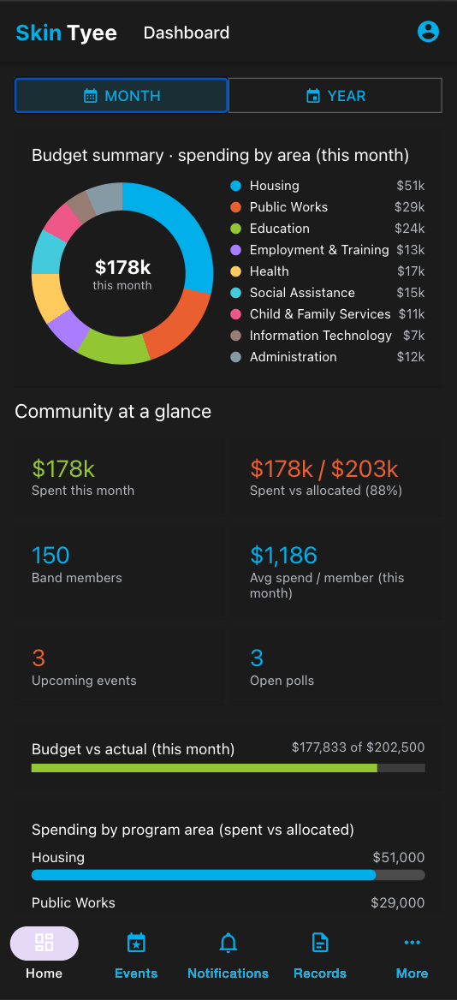 | Same dashboard with the Month reporting toggle active. |
| Dashboard — major projects | 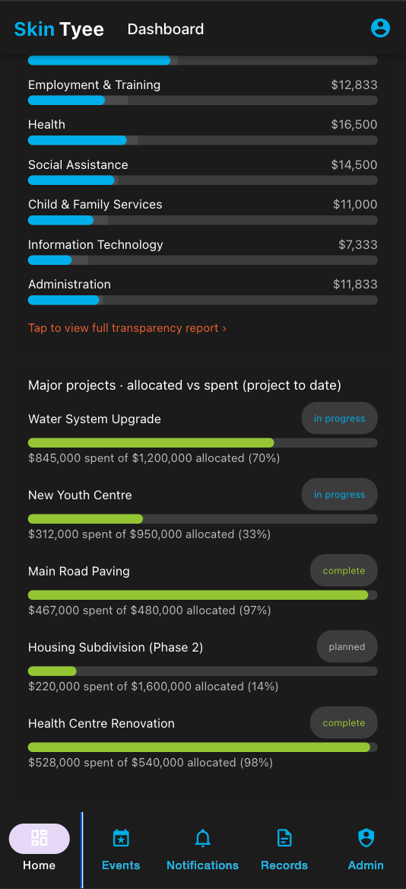 | Spending bars + major projects (allocated vs spent, project-to-date). |

## Community

| Screen | Preview | What it shows |
|---|---|---|
| Community Events |  | Event list with admin add/edit/cancel/delete. |
| Create / edit event | 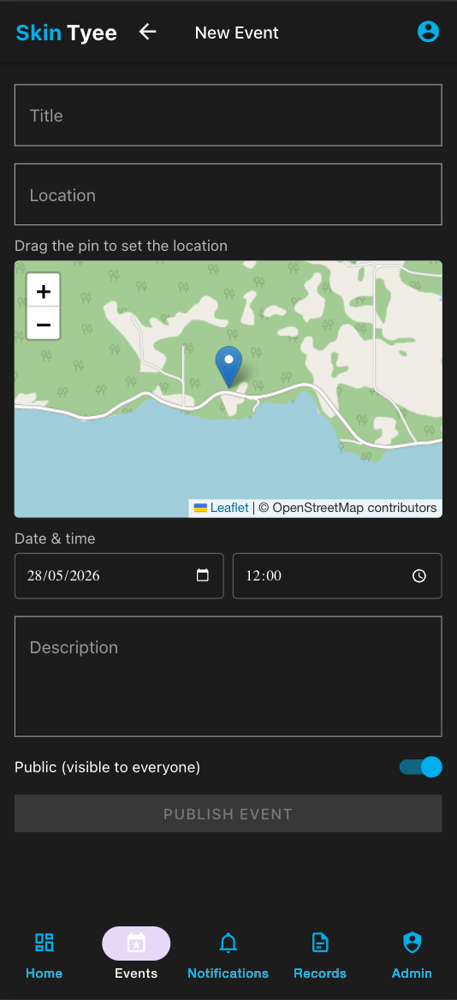 | Event form: date/time picker + draggable map pin + public toggle. |
| Event detail | 📸 _pending →_ `media/event-detail.png` | A single event's details. |
| Notifications (list) |  | Feed with WordPress categories; admin post/edit/delete. |
| Notifications (calendar) | 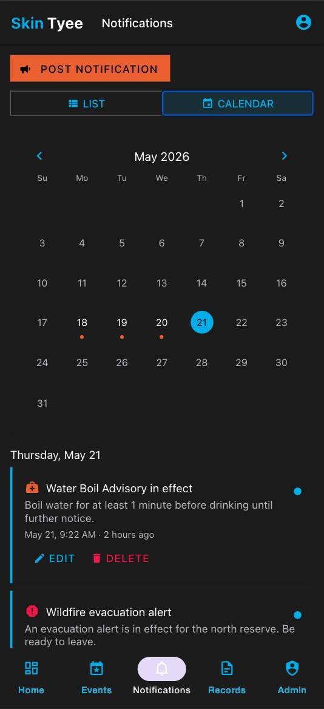 | Month calendar marking days with notifications. |
| Post / edit notification | 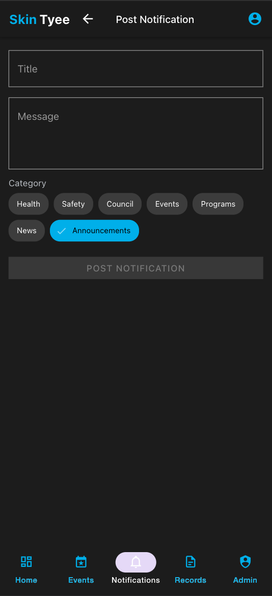 | Notification form with category chips. |
| Band Member Directory | 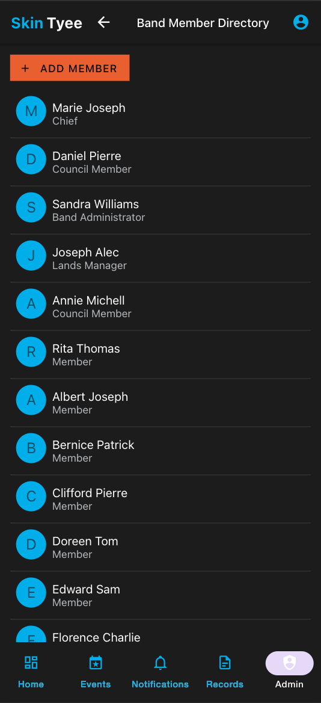 | The ~150-member directory list. |
| Member detail | 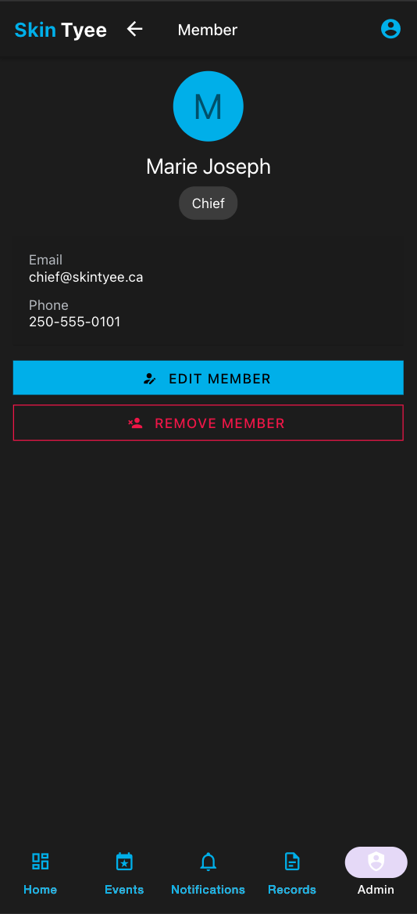 | Contact (member+); admin Edit / Remove. |
| Add member | 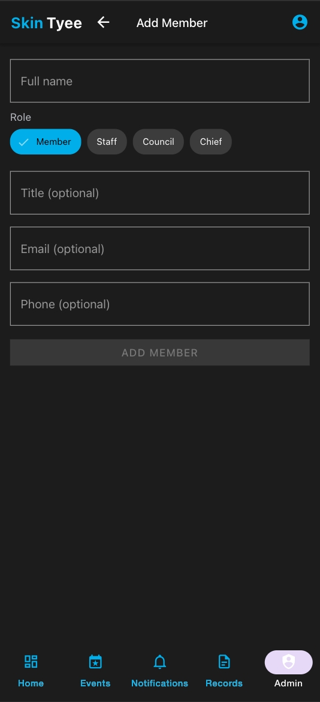 | Add-member form (name, role, contact). |
| Edit member | 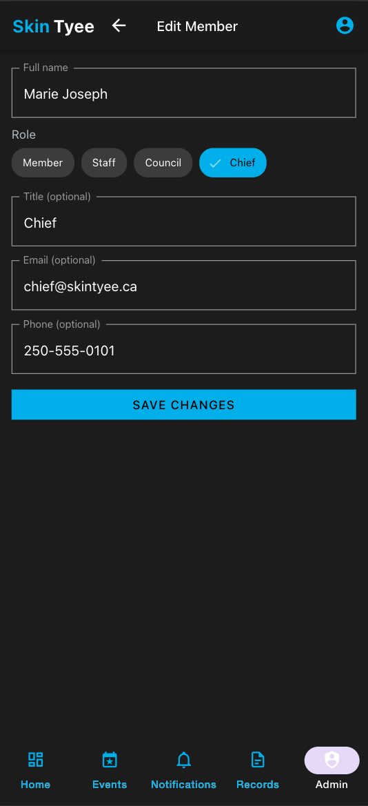 | Edit an existing member. |

## Governance

| Screen | Preview | What it shows |
|---|---|---|
| Band Meetings |  | Meetings with admin add/edit/cancel/delete. |
| Schedule / edit meeting |  | Meeting form with draggable map pin + date/time. |
| Polls — Surveys | 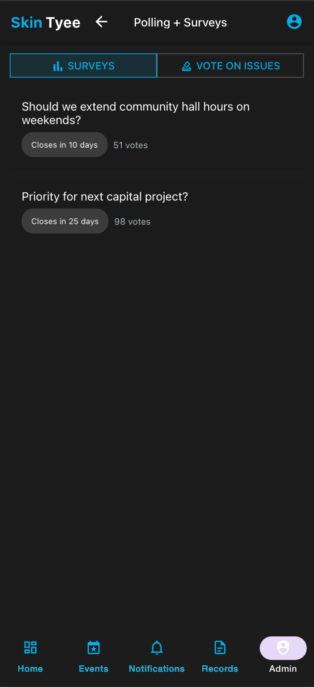 | Surveys tab of Polling + Surveys. |
| Polls — Vote on Issues | 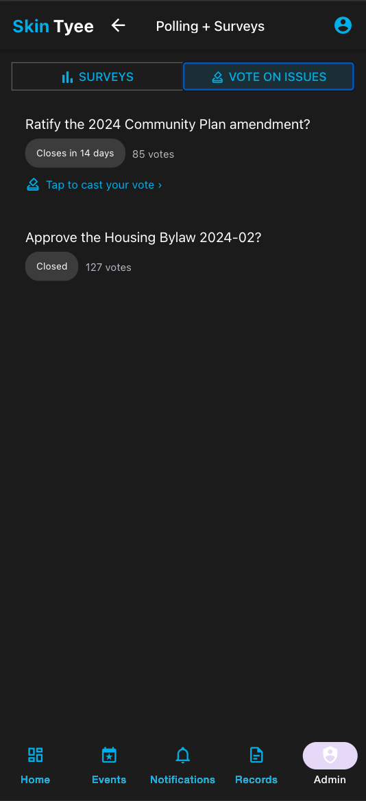 | Formal votes; "tap to cast your vote". |
| Poll detail | 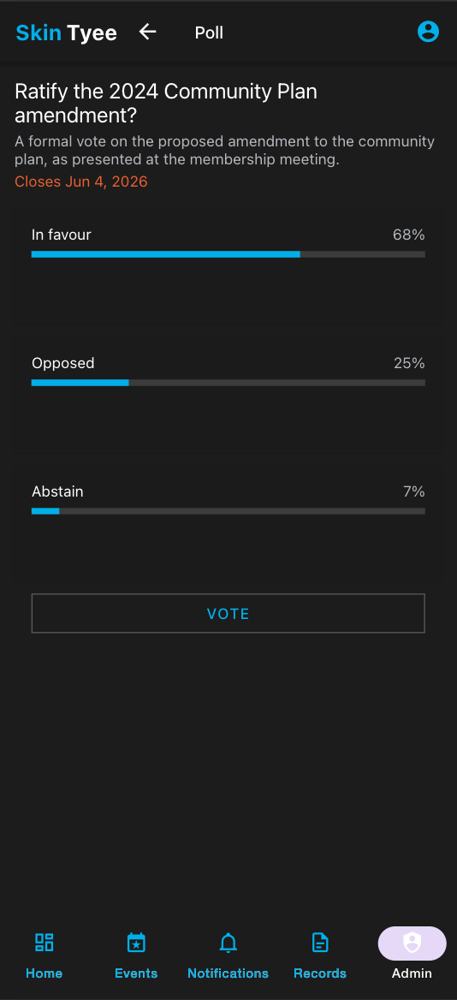 | Voting + live results bars. |

## Transparency & finance

| Screen | Preview | What it shows |
|---|---|---|
| Public Records · Transparency |  | Band expenditures by area — pie + spent-vs-budget bars. |
| Records — areas & major projects | 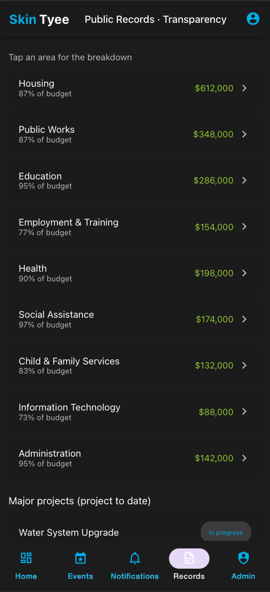 | Per-area list (tap to drill in) + major projects. |
| Expenditure breakdown | 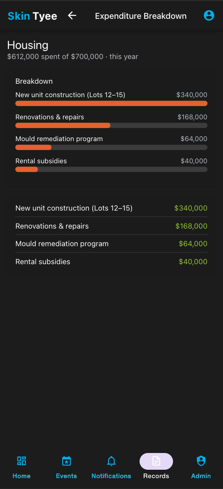 | Drill-down: how much was spent and where. |
| Financial Records (admin) | 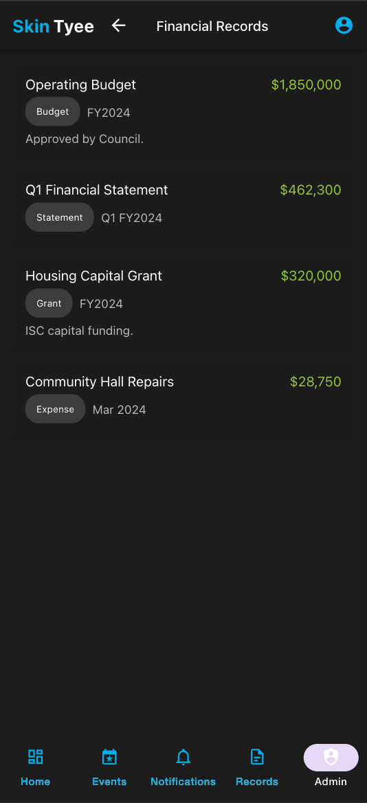 | Budgets, statements, grants, expenses. |

## Workforce (staff / admin)

| Screen | Preview | What it shows |
|---|---|---|
| Time Keeping |  | All workers' hours; admin approvals. |
| Add timesheet | 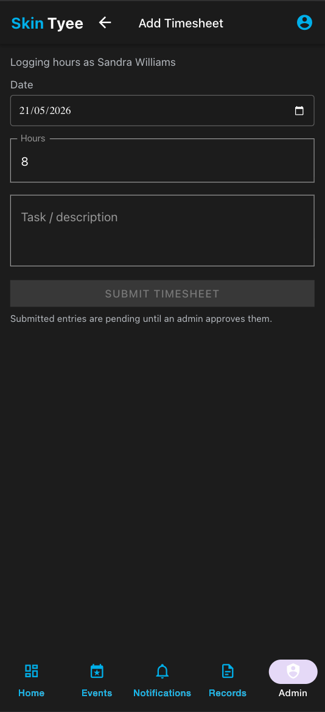 | Staff/admin log hours (date, hours, task). |

## Shared

| Screen | Preview | What it shows |
|---|---|---|
| Confirmation modal | 📸 _pending →_ `media/confirm-modal.png` | Confirm dialog for cancel/delete actions. |
