# Skin Tyee Lookup — End-to-end test results

**Run:** 2026-05-23T23:01:13.993Z · **Total time:** 180.3s · **Result:** 24/25 pass, 1 fail

> Auto-generated by `pnpm --filter @skintyee/lookup-api test:e2e`. Don't edit by hand — the next run overwrites this file.

## Summary

| # | Source | Mode | Strategy | Query | Status | Result |
|---|---|---|---|---|:---:|---|
| 1 | **OrgBook BC** | business | scrape | `Birdco` | ✅ | 7 items (4404ms) |
| 2 | **MRAS Canadian Business Registry** | business | scrape | `Two Worlds Consulting` | ✅ | 5 items (4550ms) |
| 3 | **OpenCorporates** | business | link | `Indigenous` | ✅ | link only — search URL emitted (3699ms) |
| 4 | **Corporations Canada (federal)** | business | link | `Indigenous` | ✅ | link only — search URL emitted (3467ms) |
| 5 | **CRA Charities Listings (T3010)** | business | link | `Indigenous` | ✅ | link only — search URL emitted (5383ms) |
| 6 | **ISC Indigenous Business Directory** | business | scrape | `Cambium` | ✅ | 1 items (9544ms) |
| 7 | **CCAB CAB directory** | business | scrape | `consulting` | ✅ | 25 items (7841ms) |
| 8 | **BC Indigenous Business Listings (open data)** | business | scrape | `consulting` | ✅ | 25 items (4391ms) |
| 9 | **WorkSafeBC clearance** | business | link | `Indigenous` | ✅ | link only — search URL emitted (5179ms) |
| 10 | **BCFSC SAFE Companies** | business | link | `Indigenous` | ✅ | link only — search URL emitted (12119ms) |
| 11 | **BCCSA COR / equivalency** | business | link | `Indigenous` | ✅ | link only — search URL emitted (5513ms) |
| 12 | **Court Services Online (BC civil/Supreme)** | business | link | `Indigenous` | ✅ | link only — search URL emitted (3272ms) |
| 13 | **ISC First Nation Profiles** | business | scrape | `Skin Tyee` | ❌ | returned 0 items (6967ms) |
| 14 | **FN Financial Management Board (certified Nations)** | business | scrape | `Tsleil` | ✅ | 1 items (5367ms) |
| 15 | **Company website** | business | scrape | `Birdco Industrial Resources Ltd` | ✅ | 1 items (11003ms) |
| 16 | **Open Canada — Federal contracts (>$10K)** | money | scrape | `First Nation` | ✅ | 10 items (36916ms) |
| 17 | **Open Canada — Federal grants & contributions** | money | scrape | `First Nation` | ✅ | 11 items (20448ms) |
| 18 | **Open Canada — datasets (CKAN)** | money | scrape | `Indigenous` | ✅ | 10 items (5804ms) |
| 19 | **BC Open Data — datasets (CKAN)** | money | scrape | `Indigenous` | ✅ | 10 items (3418ms) |
| 20 | **MERX — tenders & awarded contracts** | money | scrape | `First Nation` | ✅ | 25 items (5181ms) |
| 21 | **BC Bid — contract awards & opportunities** | money | link | `Indigenous` | ✅ | link only — search URL emitted (4426ms) |
| 22 | **CivicInfo BC — municipal bids** | money | link | `Indigenous` | ✅ | link only — search URL emitted (3657ms) |
| 23 | **SEDAR+ — public-company filings** | money | link | `Indigenous` | ✅ | link only — search URL emitted (3651ms) |
| 24 | **Federal Contracts (bulk CSV)** | money | link | `Indigenous` | ✅ | link only — search URL emitted (0ms) |
| 25 | **Federal Grants & Contributions (bulk CSV)** | money | link | `Indigenous` | ✅ | link only — search URL emitted (4067ms) |

## Per-source proof

### OrgBook BC

- **Source id:** `orgbook-bc` · **Category:** Corporate registries (BC) · **Strategy:** automated scrape
- **Query:** `Birdco` · **Status:** ✅ pass (7 items, 4404ms)
- **Search URL:** <https://www.orgbook.gov.bc.ca/search/?q=Birdco>

Top results extracted by the scraper:

- **[BIRDCO ENVIRONMENTAL](https://www.orgbook.gov.bc.ca/entity/FM0620716)** — FM0620716 · registration.registries.ca
- **[BIRDCO HOLDINGS LTD.](https://www.orgbook.gov.bc.ca/entity/BC0282379)** — BC0282379 · registration.registries.ca
- **[BIRDCO FILMS INC.](https://www.orgbook.gov.bc.ca/entity/BC0790418)** — BC0790418 · registration.registries.ca
- **[DP BIRDCO DEVELOPMENTS LTD.](https://www.orgbook.gov.bc.ca/entity/BC0817501)** — BC0817501 · registration.registries.ca
- **[BIRDCO INDUSTRIAL RESOURCES LTD.](https://www.orgbook.gov.bc.ca/entity/BC1217312)** — BC1217312 · registration.registries.ca
- _…and 2 more._

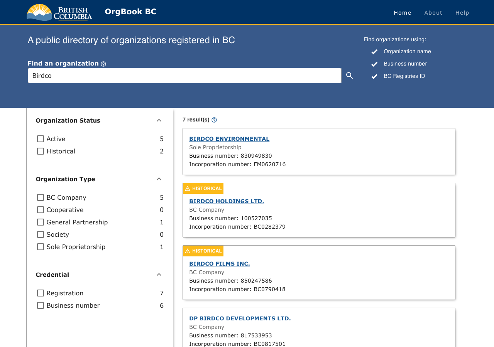

### MRAS Canadian Business Registry

- **Source id:** `mras` · **Category:** Corporate registries (cross-jurisdiction) · **Strategy:** automated scrape
- **Query:** `Two Worlds Consulting` · **Status:** ✅ pass (5 items, 4550ms)
- **Search URL:** <https://ised-isde.canada.ca/cbr-rec/en/search/results?search=Two+Worlds+Consulting>

Top results extracted by the scraper:

- **[TWO WORLD'S CONSULTING LTD.](https://ised-isde.canada.ca/cbr-rec/en/search/details?id=AB_205575236)** — AB · 205575236 · Inactive
  - Alberta Business Corporation · LLOYDMINSTER, ALBERTA · Incorporated 1993-03-04
- **[TWO WORLDS CONSULTING LTD.](https://www.orgbook.gov.bc.ca/entity/BC1078668)** — BC · BC1078668 · Active
  - BC Company · Victoria, BC · Incorporated 2016-06-09 · BN 765195722
- **[TWO WORLDS CONSULTING LTD.](https://ised-isde.canada.ca/cbr-rec/en/search/details?id=ON_5006362)** — ON · 5006362 · Active
  - EP DOMESTIC WITH SHARE · VICTORIA, BritishColumbia · Incorporated 2016-06-09
- **[TWO WORLDS CONSULTING LTD.](https://ised-isde.canada.ca/cbr-rec/en/search/details?id=SK_102065810)** — SK · 102065810 · Active
  - Extra-provincial Corporation · VICTORIA, British Columbia · Incorporated 2018-12-04 · BN 765195722SK0001
- **[TWO WORLDS CONSULTING LTD.](https://ised-isde.canada.ca/cbr-rec/en/search/details?id=AB_2120559477)** — AB · 2120559477 · Active
  - Alberta Business Corporation · Incorporated 2017-07-13

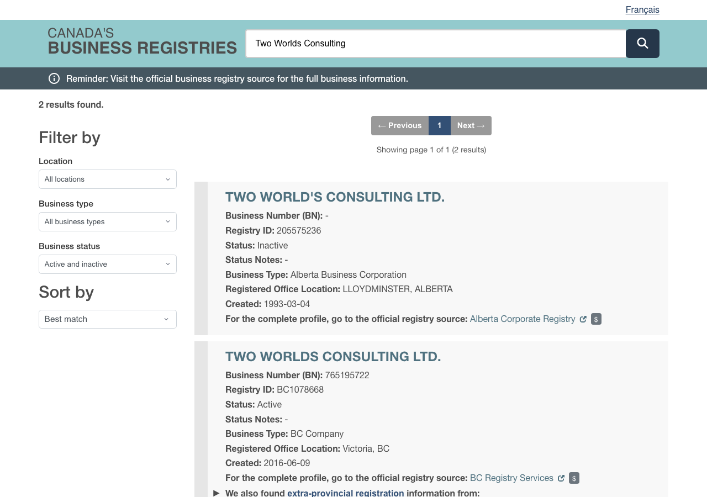

### OpenCorporates

- **Source id:** `opencorporates` · **Category:** Corporate registries (cross-jurisdiction) · **Strategy:** link only
- **Query:** `Indigenous` · **Status:** ✅ pass (link only — search URL emitted, 3699ms)
- **Search URL:** <https://opencorporates.com/companies?jurisdiction_code=ca_bc&q=Indigenous>

_Link-only source — open the search URL above to view live results._

### Corporations Canada (federal)

- **Source id:** `corporations-canada` · **Category:** Corporate registries (federal) · **Strategy:** link only
- **Query:** `Indigenous` · **Status:** ✅ pass (link only — search URL emitted, 3467ms)
- **Search URL:** <https://ised-isde.canada.ca/cc/lgcy/fdrlCrpSrch.html?V_SEARCH.command=navigate&V_TOKEN=&crpNm=Indigenous>

_Link-only source — open the search URL above to view live results._

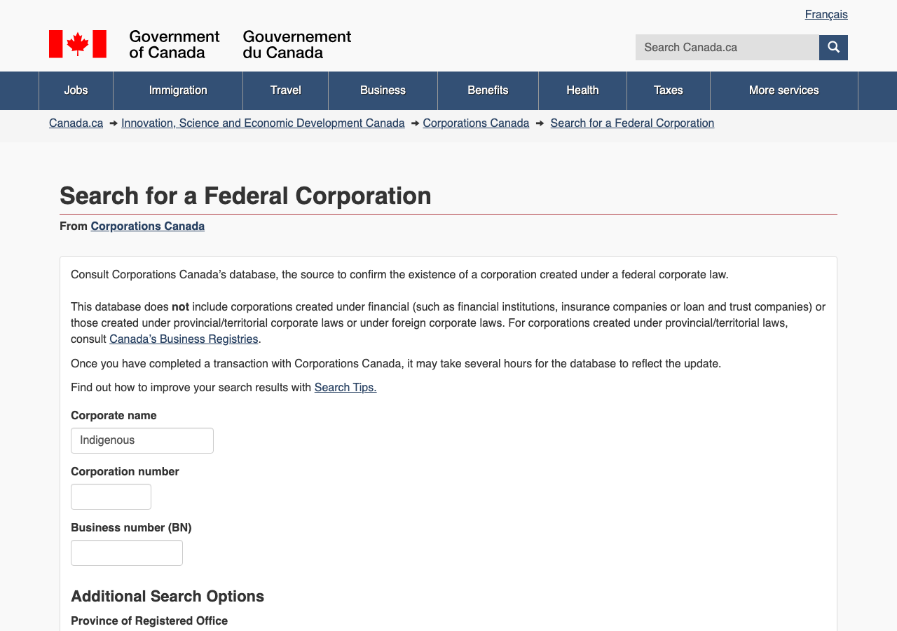

### CRA Charities Listings (T3010)

- **Source id:** `cra-charities` · **Category:** Charities · **Strategy:** link only
- **Query:** `Indigenous` · **Status:** ✅ pass (link only — search URL emitted, 5383ms)
- **Search URL:** <https://apps.cra-arc.gc.ca/ebci/hacc/srch/pub/dsplyAdvncdSrch?request_locale=en&q.bsnssNm=Indigenous>

_Link-only source — open the search URL above to view live results._

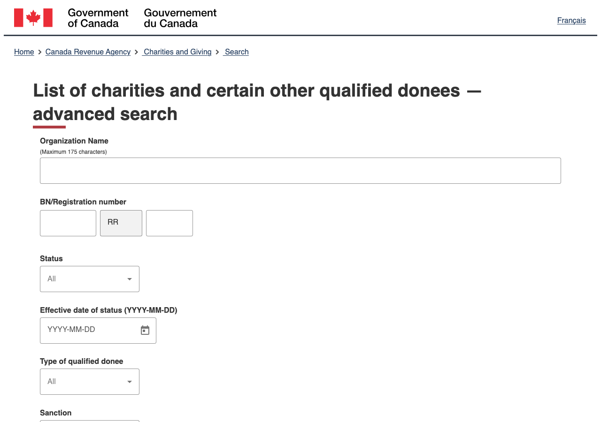

### ISC Indigenous Business Directory

- **Source id:** `isc-ibd` · **Category:** Indigenous-only directories · **Strategy:** automated scrape
- **Query:** `Cambium` · **Status:** ✅ pass (1 items, 9544ms)
- **Search URL:** <https://www.sac-isc.gc.ca/REA-IBD/eng/search?companyName=Cambium>

Top results extracted by the scraper:

- **[Cambium Indigenous Professional Services (CIPS) Inc.](https://www.sac-isc.gc.ca/REA-IBD/eng/profile?id=E689AF88865B3188E0533597D48ECD9C&index=1)**
  - Cambium Indigenous Professional Services (CIPS) Inc. CIPS is an Indigenous owned and operated environmental organization whose team is uniquely all Indigenous. Formed in 2014, we have recruited experi

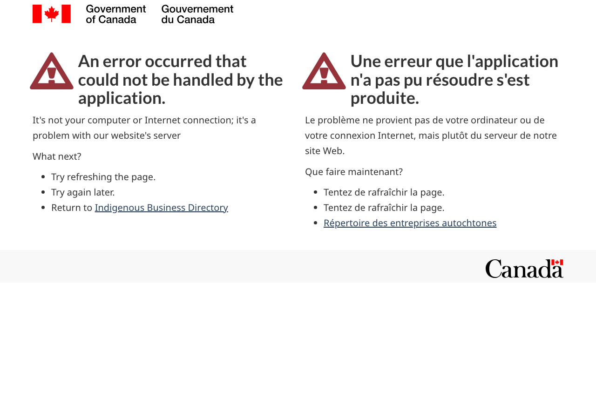

### CCAB CAB directory

- **Source id:** `ccab` · **Category:** Indigenous-only directories · **Strategy:** automated scrape
- **Query:** `consulting` · **Status:** ✅ pass (25 items, 7841ms)
- **Search URL:** <https://www.ccib.ca/main/member/?qcompanyname=consulting&qccabindustry=0&qccabprogram=797&qccabterritory=0&qccabmembershiptype=0&s=>

Top results extracted by the scraper:

- **[Takoda Consulting](https://www.ccib.ca/main/member/takoda-consulting/)**
- **[March Consulting LP](https://www.ccib.ca/main/member/march-consulting-lp/)**
- **[Ever Plan Consulting](https://www.ccib.ca/main/member/ever-plan-consulting/)**
- **[ADRM Technology Consulting Group corp.](https://www.ccib.ca/main/member/adrm-technology-consulting-group-corp/)**
- **[Pitane Consulting Services Ltd.](https://www.ccib.ca/main/member/pitane-consulting-services-ltd/)**
- _…and 20 more._

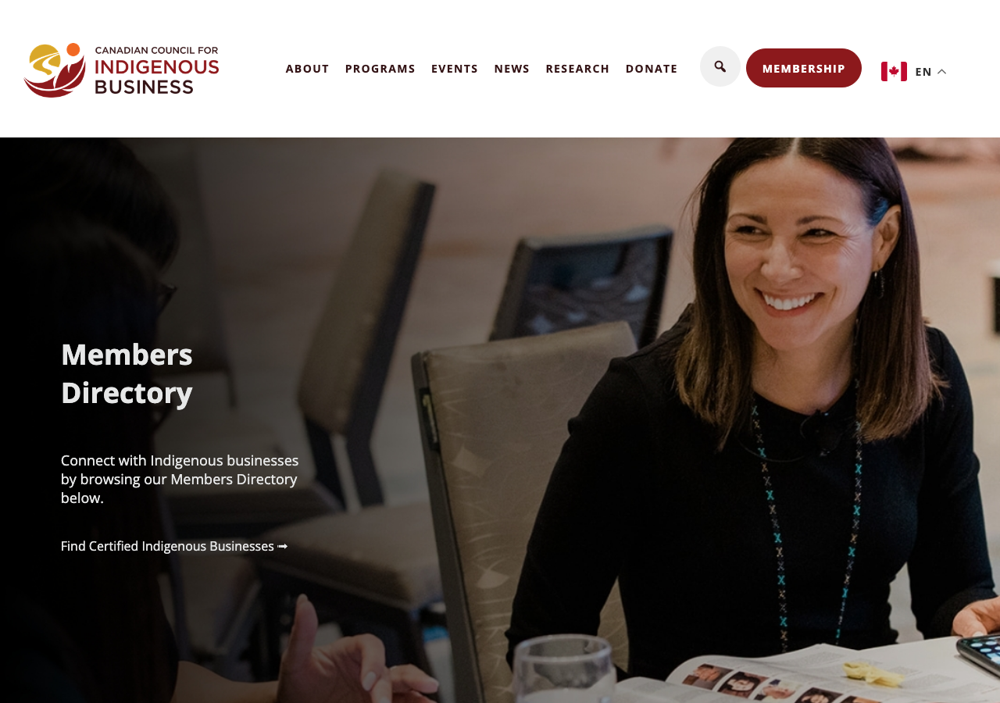

### BC Indigenous Business Listings (open data)

- **Source id:** `bc-indigenous-listings` · **Category:** Indigenous-only directories · **Strategy:** automated scrape
- **Query:** `consulting` · **Status:** ✅ pass (25 items, 4391ms)
- **Search URL:** <https://catalogue.data.gov.bc.ca/dataset/bc-indigenous-business-listings?q=consulting>

Top results extracted by the scraper:

- **Strategis Consulting Group Inc.** — TRUE · Lower Mainland / Southwest · 54 - Professional, scientific and technical services
  - Strategis Consulting Group is a single-source marketing consultancy. We are committed to helping your company's message break through the marketing noise barrier. Our consulting services encompass all
- **[Tahltan Allnorth Consultants Ltd.](http://www.allnorth.com)** — TRUE · Nechako · 23 - Construction
  - Tahltan Allnorth Consultants Ltd. (TAC) provides a full range of engineering services; surveying; construction management; exploration and geoscience; materials testing; permitting and compliance; env
- **Tsaqwa Consulting** — TRUE · Thompson / Okanagan · 54 - Professional, scientific and technical services
  - Tsaqwa Consulting provides Aboriginal relations consulting services to businesses interested in doing business with First Nations communities, First Nations economic development companies and other Ab
- **[Rescan Tahltan Environmental Consultants  (RTEC)](http://www.tndc.ca/resource-development)** — TRUE · Nechako · 54 - Professional, scientific and technical services
  - Rescan Tahltan Environmental Consultants (RTEC) conducts environmental assessments of projects in Tahltan territory and has an office in Dease Lake. Services include environmental consulting (fisherie
- **[Columbia Environmental Consulting Ltd.](http://www.ourokanagan.ca/business/columbia-environmental-consulting-ltd.html)** — TRUE · Thompson / Okanagan · 54 - Professional, scientific and technical services
  - Columbia Environmental is a resource management and environmental engineering consulting firm located in Penticton, British Columbia. Established in 1999, we offer a wide variety of services including
- _…and 20 more._

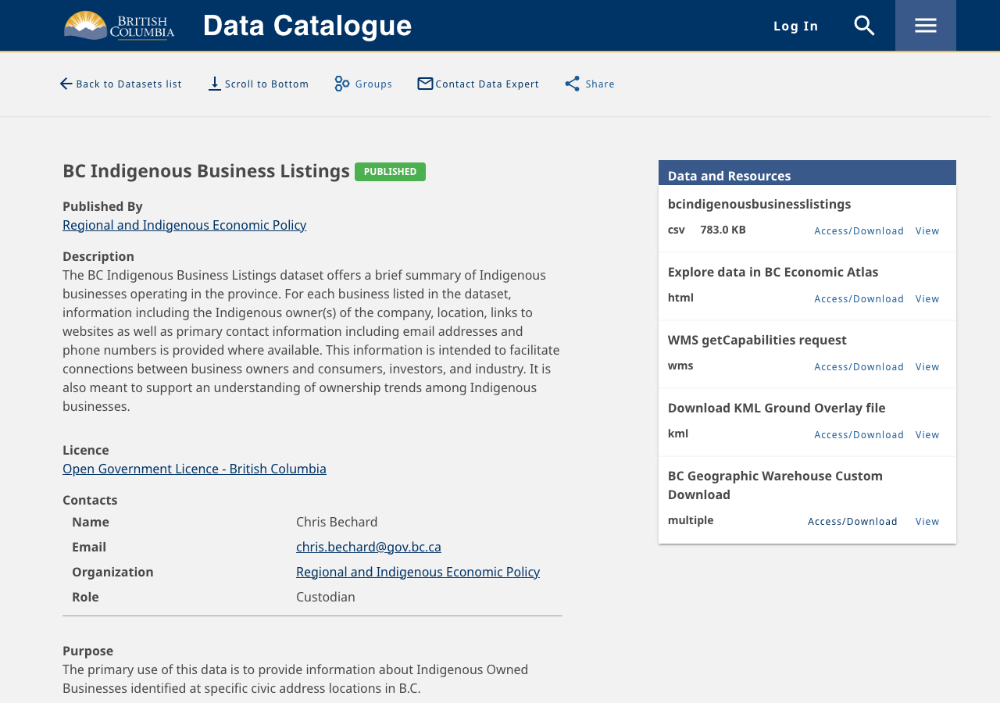

### WorkSafeBC clearance

- **Source id:** `worksafebc` · **Category:** Safety / certification · **Strategy:** link only
- **Query:** `Indigenous` · **Status:** ✅ pass (link only — search URL emitted, 5179ms)
- **Search URL:** <https://online.worksafebc.com/anonymous/clearance/>

_Link-only source — open the search URL above to view live results._

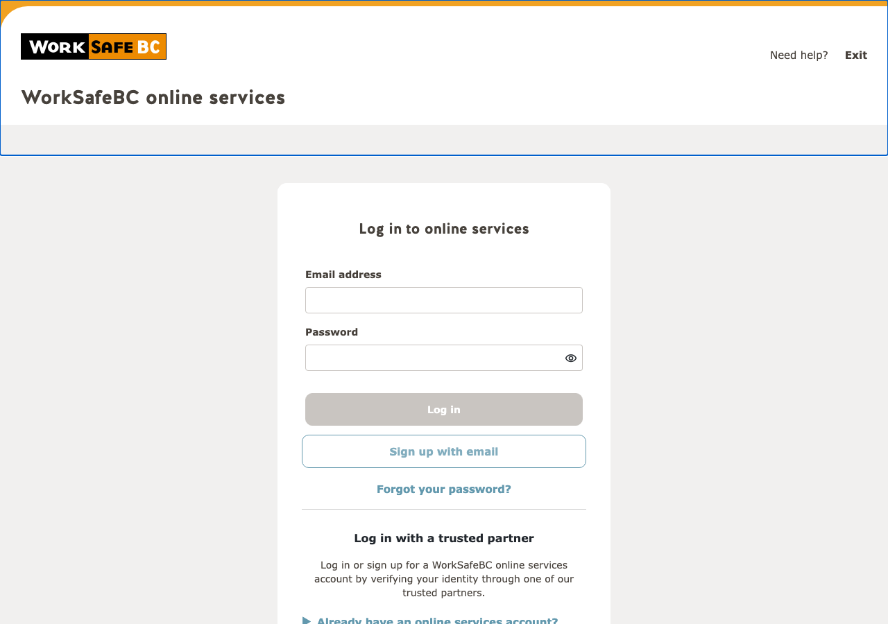

### BCFSC SAFE Companies

- **Source id:** `bcfsc-safe` · **Category:** Safety / certification · **Strategy:** link only
- **Query:** `Indigenous` · **Status:** ✅ pass (link only — search URL emitted, 12119ms)
- **Search URL:** <https://www.bcforestsafe.org/?s=Indigenous>

_Link-only source — open the search URL above to view live results._

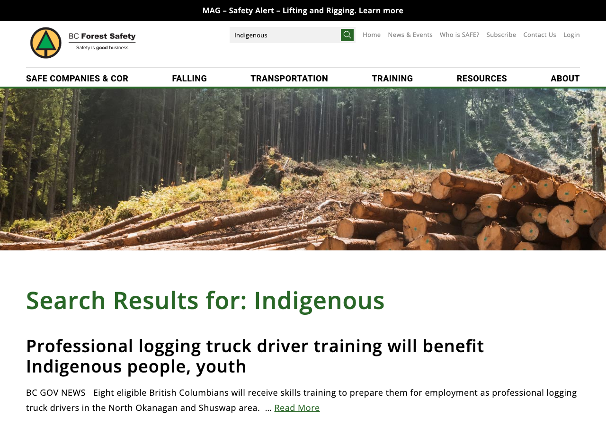

### BCCSA COR / equivalency

- **Source id:** `bccsa-cor` · **Category:** Safety / certification · **Strategy:** link only
- **Query:** `Indigenous` · **Status:** ✅ pass (link only — search URL emitted, 5513ms)
- **Search URL:** <https://www.bccsa.ca/?s=Indigenous>

_Link-only source — open the search URL above to view live results._

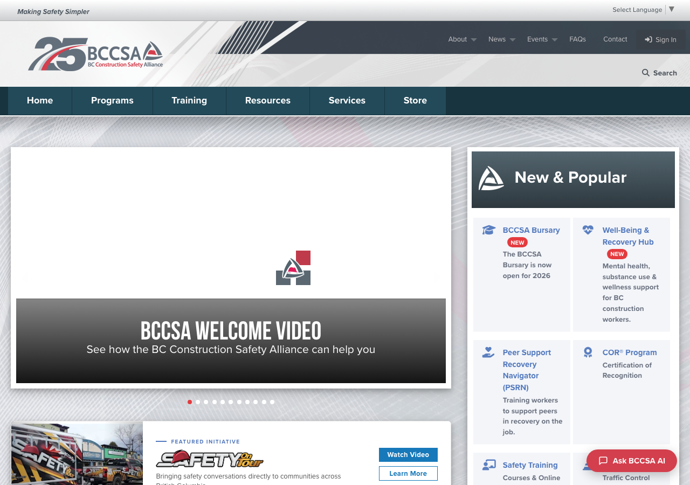

### Court Services Online (BC civil/Supreme)

- **Source id:** `cso` · **Category:** Litigation / public records · **Strategy:** link only
- **Query:** `Indigenous` · **Status:** ✅ pass (link only — search URL emitted, 3272ms)
- **Search URL:** <https://justice.gov.bc.ca/cso/esearch/civil/partySearch.do>

_Link-only source — open the search URL above to view live results._

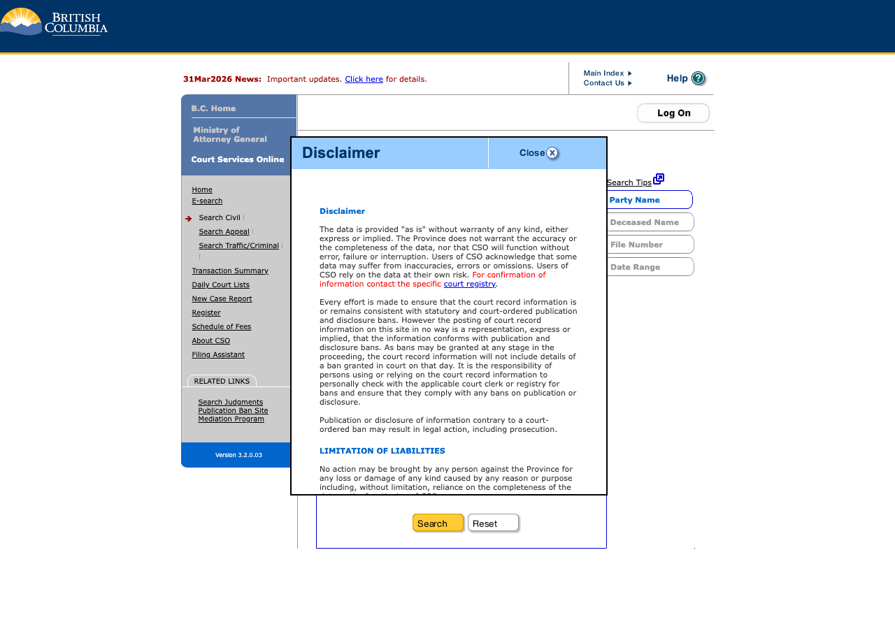

### ISC First Nation Profiles

- **Source id:** `fn-profiles` · **Category:** First Nations · **Strategy:** automated scrape
- **Query:** `Skin Tyee` · **Status:** ❌ fail (returned 0 items, 6967ms)
- **Search URL:** <https://fnp-ppn.aadnc-aandc.gc.ca/fnp/Main/Search/SearchFN.aspx?lang=eng&q=Skin%20Tyee>

_No items extracted on this run — see the screenshot below for what the live search returned._

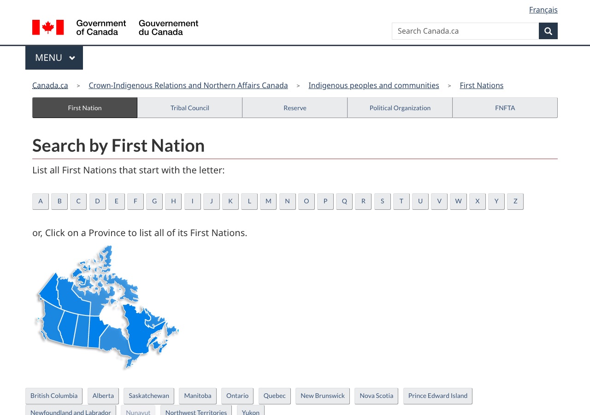

### FN Financial Management Board (certified Nations)

- **Source id:** `fn-fma` · **Category:** First Nations · **Strategy:** automated scrape
- **Query:** `Tsleil` · **Status:** ✅ pass (1 items, 5367ms)
- **Search URL:** <https://fnfmb.com/en/our-work/financial-management-system-certification>

Top results extracted by the scraper:

- **[Tsleil-Waututh Nation](https://fnfmb.com/en/our-work/financial-management-system-certification)** — FMA-certified

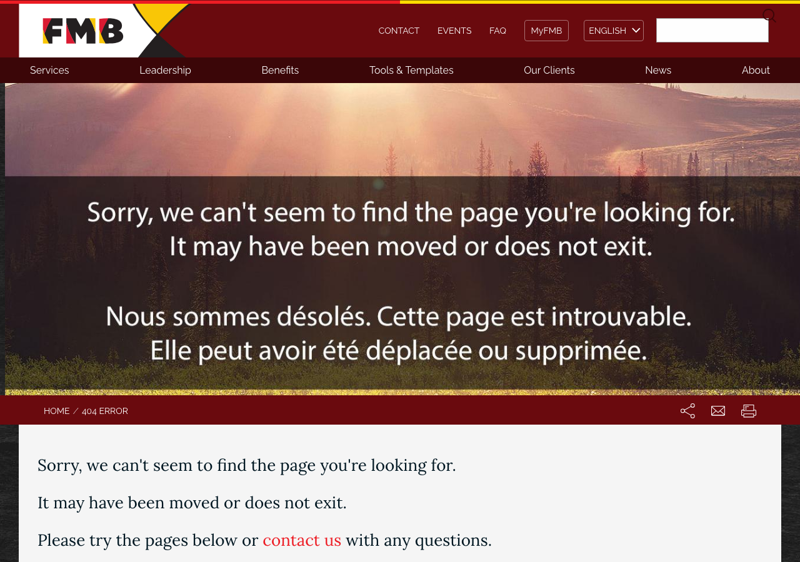

### Company website

- **Source id:** `website` · **Category:** Self-disclosed · **Strategy:** automated scrape
- **Query:** `Birdco Industrial Resources Ltd` · **Status:** ✅ pass (1 items, 11003ms)
- **Search URL:** <https://birdcoirl.ca>

Top results extracted by the scraper:

- **[Birdco Industrial Resources | Home](https://birdcoirl.ca)** — https://birdcoirl.ca
  - Birdco is a Lheidli T’enneh First Nation member-owned construction company offering full-service support for civil, structural, and mechanical projects. We specialize in partnerships with Indigenous c

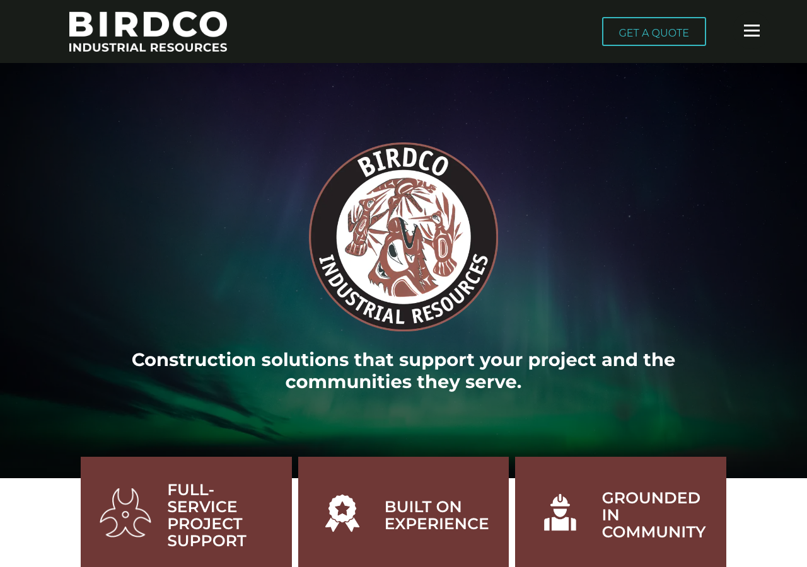

### Open Canada — Federal contracts (>$10K)

- **Source id:** `open-canada-contracts` · **Category:** Federal contracts / grants · **Strategy:** automated scrape
- **Query:** `First Nation` · **Status:** ✅ pass (10 items, 36916ms)
- **Search URL:** <https://search.open.canada.ca/contracts/?search_text=First+Nation>

Top results extracted by the scraper:

- **[FIRST NATION CREATIONS PRODUCTIONS](https://search.open.canada.ca/contracts/record/nfb-onf%2CC-2025-2026-Q4-00026)** — Total Value:  $32,634.07
  - Contract Date: Mar 4, 2026 · Original Value: $32,634.07 · Work Description: Other professional services not elsewhere specified · Instrument Type: Contract · Commodity Type: Service · Comments: Audiov
- **[FIRST NATION CREATIONS PRODUCTIONS](https://search.open.canada.ca/contracts/record/nfb-onf%2CC-2025-2026-Q4-00027)** — Total Value:  $47,785.50
  - Contract Date: Mar 4, 2026 · Original Value: $47,785.50 · Work Description: Other professional services not elsewhere specified · Instrument Type: Contract · Commodity Type: Service · Comments: Audiov
- **[IRON HORSE NIIBAWI LTD](https://search.open.canada.ca/contracts/record/ps-sp%2CC-2025-2026-Q4-00012)** — Total Value:  $42,375.08
  - Contract Date: Jan 29, 2026 · Original Value: $42,375.08 · Work Description: Management consulting · Instrument Type: Contract · Commodity Type: Service · Additional Comments: Collecting First Nations
- **[Yukon Arts Centre Corporation](https://search.open.canada.ca/contracts/record/dfatd-maecd%2CC-2025-2026-Q3-01203)** — Total Value:  $15,000.00
  - Contract Date: Dec 31, 2025 · Original Value: $15,000.00 · Work Description: Transportation of things not elsewhere specified · Instrument Type: Contract · Commodity Type: Service · Comments: Yukon Fi
- **[GEOVERRA INC.](https://search.open.canada.ca/contracts/record/nrcan-rncan%2CC-2025-2026-Q3-00300)** — Total Value:  $39,690.00
  - Contract Date: Dec 19, 2025 · Original Value: $39,690.00 · Work Description: Suspense account (debit)-Other government departments · Instrument Type: Contract · Commodity Type: Service · Additional Co
- _…and 5 more._

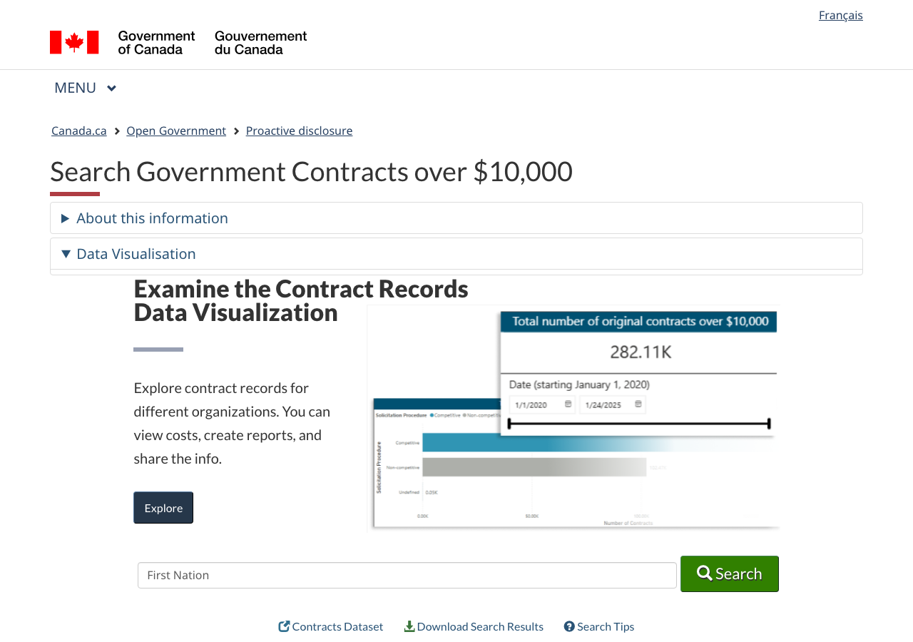

### Open Canada — Federal grants & contributions

- **Source id:** `open-canada-grants` · **Category:** Federal contracts / grants · **Strategy:** automated scrape
- **Query:** `First Nation` · **Status:** ✅ pass (11 items, 20448ms)
- **Search URL:** <https://search.open.canada.ca/grants/?search_text=First+Nation>

Top results extracted by the scraper:

- **[Mediphage Bioceuticals, Inc.](https://search.open.canada.ca/grants/record/nrc-cnrc%2C172-2025-2026-Q2-1034675%2Ccurrent)**
  - Agreement: Agreement Number: 1034675 · Agreement Number: Duration: from Jan 1, 2027 to Mar 26, 2027 · Duration: Description: As part of the international consortium project “UK Biomanufacturing - 1014
- **[The Nature Conservancy of Canada](https://search.open.canada.ca/grants/record/pc%2C154-2025-2026-Q3-00089%2Ccurrent)**
  - Agreement: Agreement Number: GC-3239,1 · Agreement Number: Duration: from Dec 15, 2026 to May 31, 2027 · Duration: Description: This contribution supports the Nature Conservancy of Canada in the estab
- **[Amendments](https://search.open.canada.ca/grants/record/pc%2C154-2025-2026-Q3-00089%2Ccurrent?amendments)**
  - Agreement: Agreement Number: GC-3239,1 · Agreement Number: Duration: from Dec 15, 2026 to May 31, 2027 · Duration: Description: This contribution supports the Nature Conservancy of Canada in the estab
- **[Northern Ontario Enterprise Gateway Point d'accès pour les entreprises du nord l'Ontario](https://search.open.canada.ca/grants/record/fednor%2C200-2025-2026-Q4-036%2Ccurrent)**
  - Agreement: Agreement Number: 900471 · Agreement Number: Duration: from Jul 1, 2026 to Jun 30, 2029 · Duration: Description: A program to support access to capital for small and medium sized business, 
- **[CANADIAN ASSOCIATION OF GIFT PLANNERS / ASSOCIATION CANADIENNE DES PROFESSIONNELS EN DONS PLANIFIÉS](https://search.open.canada.ca/grants/record/pch%2C016-2025-2026-Q4-1380095%2Ccurrent)**
  - Agreement: Agreement Number: 1380095 · Agreement Number: Duration: from Apr 13, 2026 to Apr 18, 2026 · Duration: Description: Enhancement of Official Languages Program - Promotion of Linguistic Dualit
- _…and 6 more._

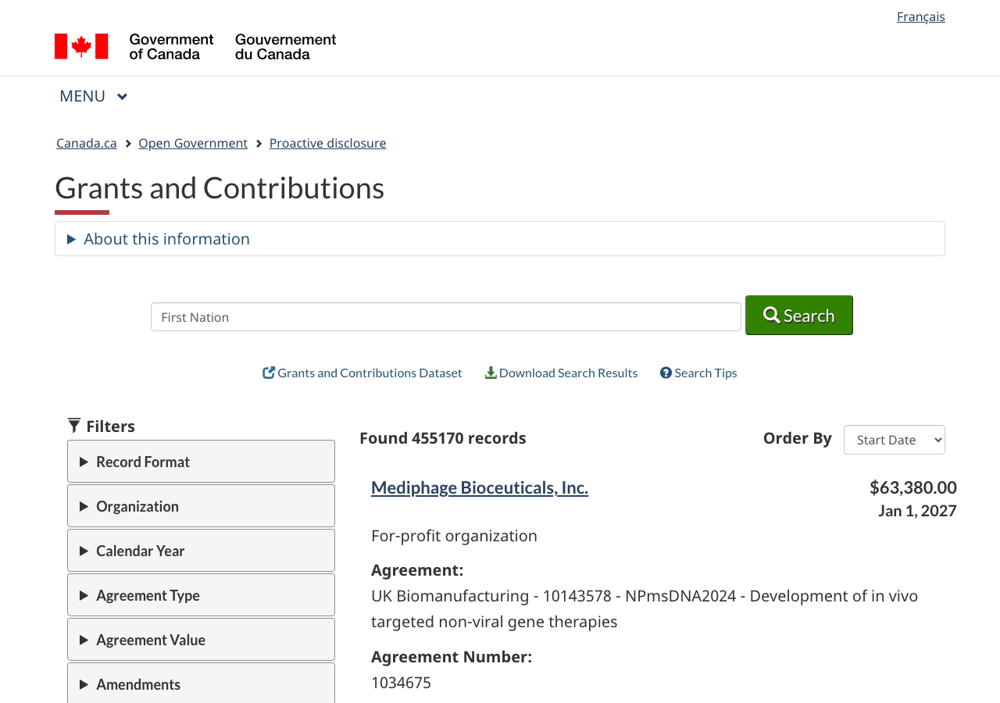

### Open Canada — datasets (CKAN)

- **Source id:** `open-canada-ckan` · **Category:** Open-data catalogues · **Strategy:** automated scrape
- **Query:** `Indigenous` · **Status:** ✅ pass (10 items, 5804ms)
- **Search URL:** <https://open.canada.ca/data/en/dataset?q=Indigenous>

Top results extracted by the scraper:

- **[Criminal Risk Index Validation for Indigenous and Non-Indigenous Men](https://open.canada.ca/data/en/dataset/c5f66928-a085-4116-ab9d-316534701c27)** — Correctional Service of Canada | Service correctionnel du Canada
  - Based on the CRI development data, a total of 24,972 men first releases (4,850 Indigenous and 19,996 Non-Indigenous) were gathered over a six-year period (2006-07 to 2011-12) and followed-up for retur
- **[Substance use patterns of indigenous and Non-Indigenous Women Offenders ](https://open.canada.ca/data/en/dataset/af5ac71a-e1c0-42d0-97a4-45b9cb75f43a)** — Correctional Service of Canada | Service correctionnel du Canada
  - Substance use issues continue to be prevalent among women offenders, particularly Indigenous women.
- **[Indigenous Justice Strategy](https://open.canada.ca/data/en/dataset/12c8daad-cfbd-4803-ba88-612bae32f1cf)** — Department of Justice Canada | Ministère de la Justice Canada
  - In consultation and cooperation with Indigenous and provincial and territorial partners, Justice Canada is developing an Indigenous Justice Strategy to address systemic discrimination and the overrepr
- **[Indigenous healing lodges](https://open.canada.ca/data/en/dataset/9a5f4e21-ac60-4370-aaa3-e4002d8c9d6b)** — Correctional Service of Canada | Service correctionnel du Canada
  - Healing lodges are environments designed specifically for Indigenous offenders. They offer culturally appropriate services and programs to offenders in a way that incorporates Indigenous values, tradi
- **[Indigenous Justice Program](https://open.canada.ca/data/en/dataset/52fddeb0-75ac-4e6b-ae42-3fecbe7c50c6)** — Department of Justice Canada | Ministère de la Justice Canada
  - The Aboriginal Justice Strategy (AJS), now known as the Indigenous Justice Program, supports community-based justice programs that offer alternatives to mainstream justice processes in appropriate cir
- _…and 5 more._

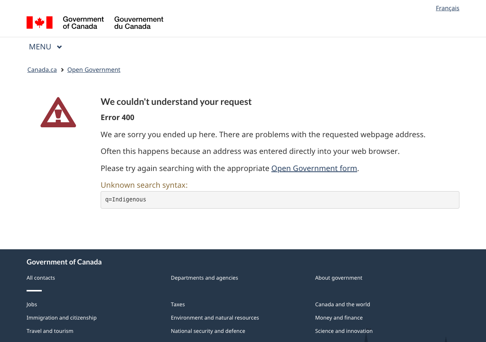

### BC Open Data — datasets (CKAN)

- **Source id:** `bc-open-data-ckan` · **Category:** Open-data catalogues · **Strategy:** automated scrape
- **Query:** `Indigenous` · **Status:** ✅ pass (10 items, 3418ms)
- **Search URL:** <https://catalogue.data.gov.bc.ca/dataset?q=Indigenous>

Top results extracted by the scraper:

- **[Indigenous Economic Organizations Directory](https://catalogue.data.gov.bc.ca/dataset/indigenous-economic-organizations-directory)** — Regional and Indigenous Economic Policy
  - The Indigenous Economic Development Dataset provides an overview of some of the key Indigenous Economic organizations operating in BC and Nationally. For each organization, you'll find details on the 
- **[BC Indigenous Business Listings](https://catalogue.data.gov.bc.ca/dataset/bc-indigenous-business-listings)** — Regional and Indigenous Economic Policy
  - The BC Indigenous Business Listings dataset offers a brief summary of Indigenous businesses operating in the province. For each business listed in the dataset, information including the Indigenous own
- **[Indigenous Economic Development Directory](https://catalogue.data.gov.bc.ca/dataset/indigenous-economic-development-directory)** — Regional and Indigenous Economic Policy
  - The Indigenous Economic Development Directory dataset provides a comprehensive summary of the sectors of interest for Indigenous economic development corporations across British Columbia. For each cor
- **[BC Geographical Names - Indigenous Tag](https://catalogue.data.gov.bc.ca/dataset/bc-geographical-names-indigenous-tag)** — Heritage Branch
  - Dataset include names in the BC Geographical Names Information System (BCGNIS) with any origins or connection to Indigenous languages, peoples or histories, including Indigenous names or words which t
- **[Active Apprenticeship Registrations by Trade and Indigenous](https://catalogue.data.gov.bc.ca/dataset/active-apprenticeship-registrations-by-trade-and-indigenous)** — SkilledTradesBC
  - The number of active Indigenous and non-Indigenous apprenticeship registrations as of March 31 from 2016 to 2025 by trade.
- _…and 5 more._

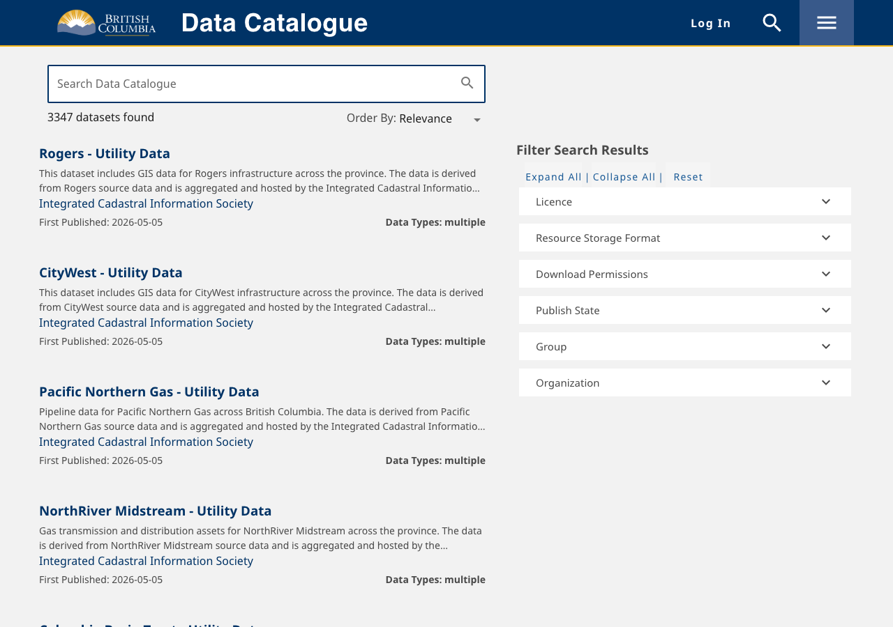

### MERX — tenders & awarded contracts

- **Source id:** `merx` · **Category:** Bids / solicitations · **Strategy:** automated scrape
- **Query:** `First Nation` · **Status:** ✅ pass (25 items, 5181ms)
- **Search URL:** <https://www.merx.com/public/solicitations/open?keywords=First%20Nation&language=EN>

Top results extracted by the scraper:

- **[Snaw-Naw-As Multi Use Trail (Phase 2)
				                 					
									 
			        	                    Nanoose First Nation
						            
						                British Co](https://www.merx.com/public/supplier/interception/view-notice/444000793995?origin=0)**
- **[Stein River Intake Project - Construction
				                 					
									 
			        	                    Lytton First Nation
						            
						                British](https://www.merx.com/public/supplier/interception/view-notice/444008772358?origin=0)**
- **[COTTFN - Child and Family Wellbeing Services - Feasibility Study
				                 					
									 
			        	                    Chippewas of the Thames First Nation
						  ](https://www.merx.com/solicitations/open-bids/COTTFN-Child-and-Family-Wellbeing-Services-Feasibility-Study/0000319878?origin=0)**
- **[Fraser River Bridge – Detailed Design and Roadway Approaches
				                 					
									 
			        	                    Lheidli T'enneh First Nation
						            
	](https://www.merx.com/public/supplier/interception/view-notice/443947654715?origin=0)**
- **[Alexander First Nation-Lift Stations Upgrade (East and West LS Construction)
				                 					
									 
			        	                    McElhanney Ltd
						            ](https://www.merx.com/solicitations/open-bids/Alexander-First-Nation-Lift-Stations-Upgrade-East-and-West-LS-Construction/0000321580?origin=0)**
- _…and 20 more._

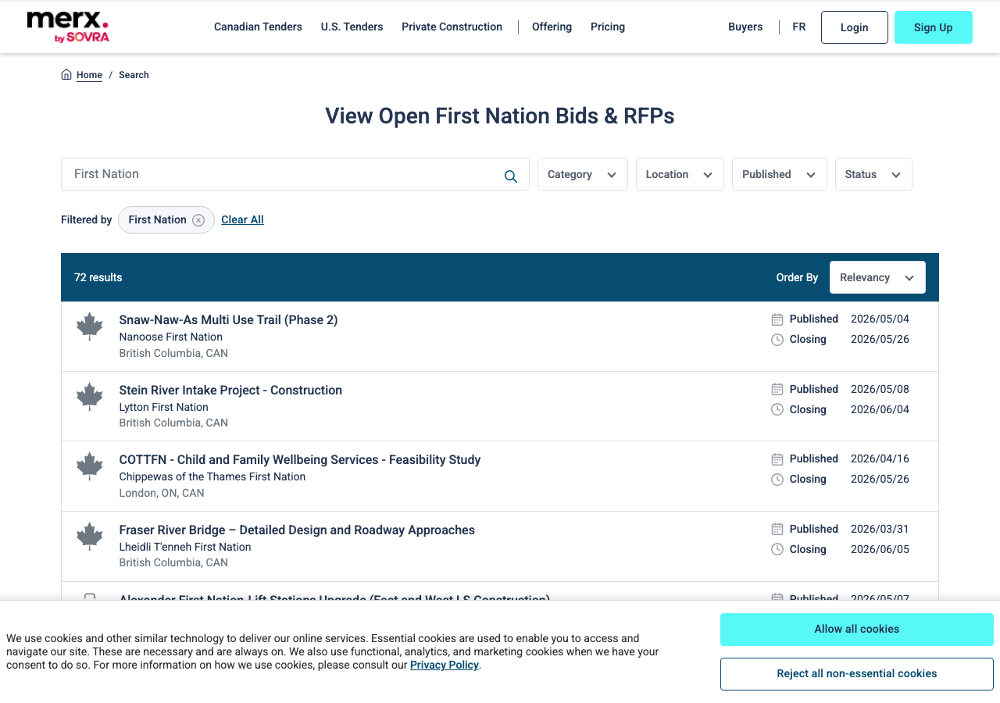

### BC Bid — contract awards & opportunities

- **Source id:** `bc-bid` · **Category:** Provincial bids · **Strategy:** link only
- **Query:** `Indigenous` · **Status:** ✅ pass (link only — search URL emitted, 4426ms)
- **Search URL:** <https://www.bcbid.gov.bc.ca/page.aspx/en/rfp/contract_award_list_public>

_Link-only source — open the search URL above to view live results._

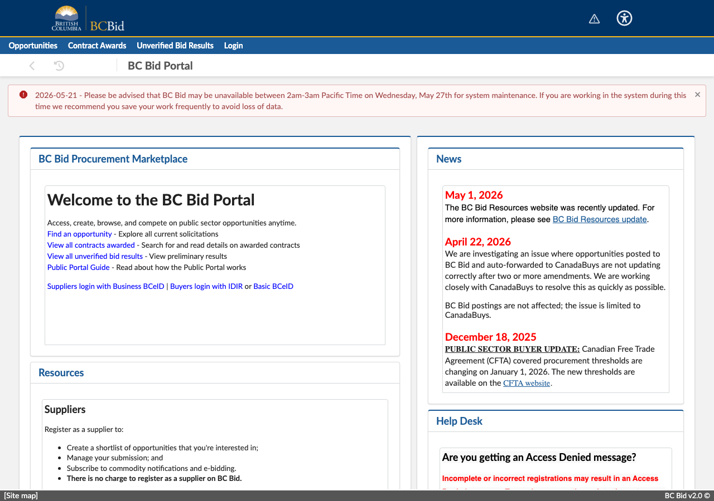

### CivicInfo BC — municipal bids

- **Source id:** `civicinfo-bc` · **Category:** Provincial bids · **Strategy:** link only
- **Query:** `Indigenous` · **Status:** ✅ pass (link only — search URL emitted, 3657ms)
- **Search URL:** <https://www.civicinfo.bc.ca/bids?keyword=Indigenous>

_Link-only source — open the search URL above to view live results._

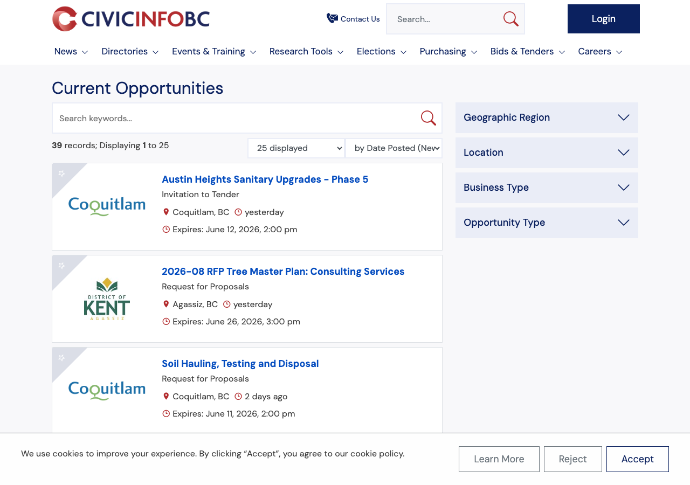

### SEDAR+ — public-company filings

- **Source id:** `sedar-plus` · **Category:** Public-company filings · **Strategy:** link only
- **Query:** `Indigenous` · **Status:** ✅ pass (link only — search URL emitted, 3651ms)
- **Search URL:** <https://www.sedarplus.ca/csa-party/service/create?targetUrl=%2Flandingpage%2Fservice%2Fsearch>

_Link-only source — open the search URL above to view live results._

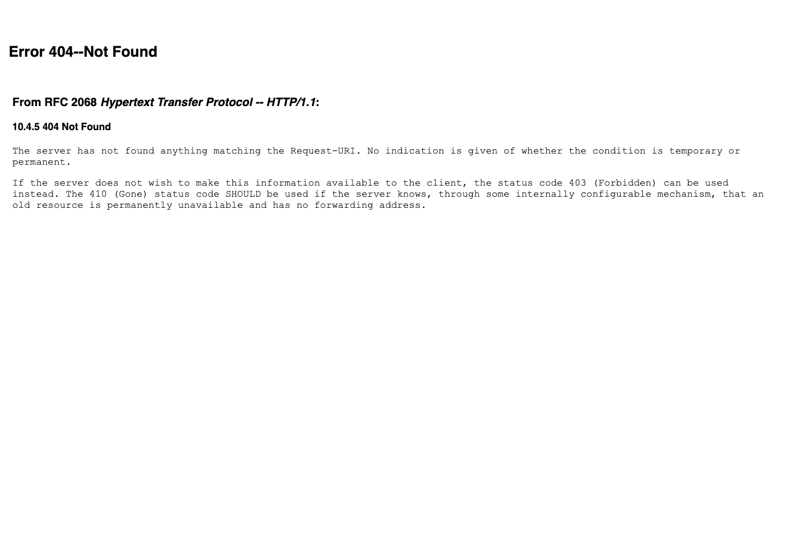

### Federal Contracts (bulk CSV)

- **Source id:** `contracts-csv` · **Category:** Federal contracts / grants · **Strategy:** link only
- **Query:** `Indigenous` · **Status:** ✅ pass (link only — search URL emitted, 0ms)
- **Search URL:** <https://open.canada.ca/data/dataset/d8f85d91-7dec-4fd1-8055-483b77225d8b/resource/fac950c0-00d5-4ec1-a4d3-9cbebf98a305/download/contracts.csv>

_Link-only source — open the search URL above to view live results._

### Federal Grants & Contributions (bulk CSV)

- **Source id:** `grants-csv` · **Category:** Federal contracts / grants · **Strategy:** link only
- **Query:** `Indigenous` · **Status:** ✅ pass (link only — search URL emitted, 4067ms)
- **Search URL:** <https://open.canada.ca/data/en/dataset/432527ab-7aac-45b5-81d6-7597107a7013>

_Link-only source — open the search URL above to view live results._

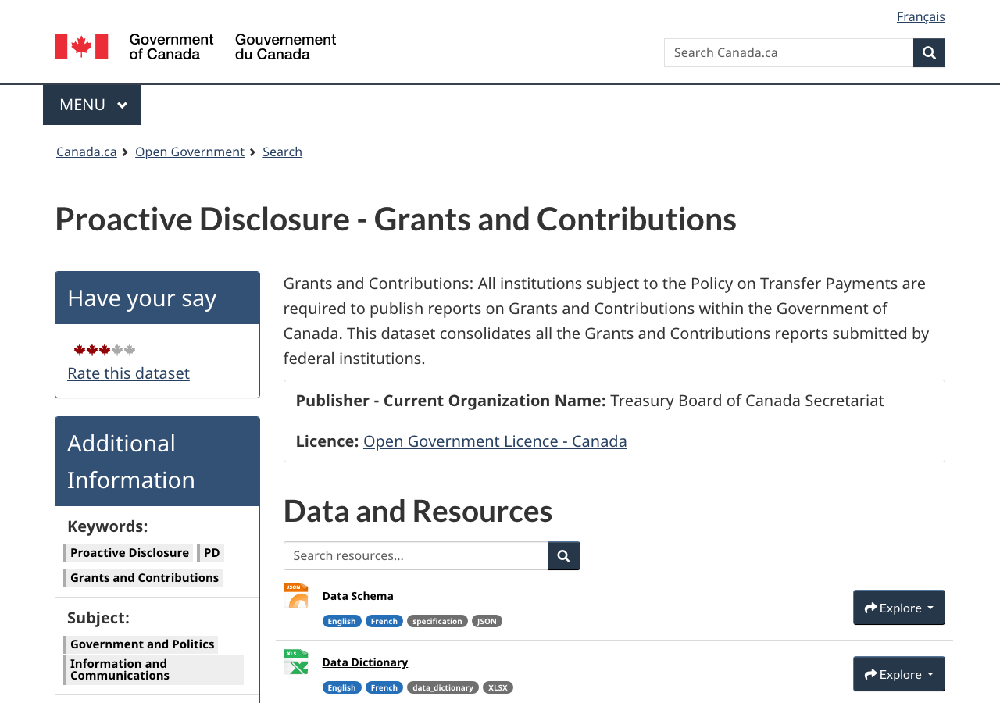
